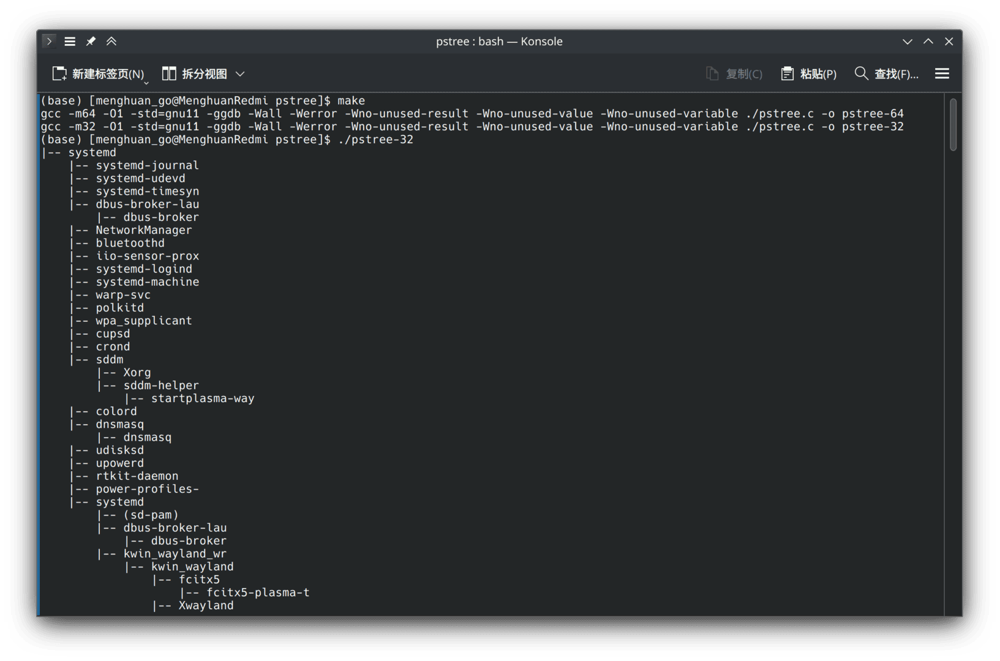

Date: 2024-03-03
Modified: 2024-03-10
Title: 在Arch Linux下编译32位C程序出错
Tags: Arch, Linux, Bugs
Slug: Gcc_And_CUDA_Version
category: Linux

最近在跟着学习南京大学蒋老师的[操作系统课程](https://jyywiki.cn/OS/2024/)，~~虽然第一个实验“打印进程树”就卡了好久~~，实验要求`编写可移植的代码`，这儿就是同时编译32-bit 和 64-bit 的版本，因此开始愉快地安装库->编译。

## 安装相应的包

默认情况下Arch是不启用Multilib仓库(内含32位软件和连接库)的，如果你还没有启用首先当然是[启用Multilib仓库](https://wiki.archlinuxcn.org/wiki/%E5%AE%98%E6%96%B9%E4%BB%93%E5%BA%93#%E5%90%AF%E7%94%A8multilib)。

随后更新软件包列表并安装相应的GCC32位库：
```bash
sudo pacman -Syu
sudo pacman -S lib32-gcc-libs
```

随后就可以愉快地使用
```bash
gcc -m32 pstree.c -o pstree-32
```
编译32位软件了。

当然这儿应该直接使用`Makefile`进行编译，不过问题这时候就来了，居然得到了报错如下:
```bash
gcc -m32 -O1 -std=gnu11 -ggdb -Wall -Werror -Wno-unused-result -Wno-unused-value -Wno-unused-variable ./pstree.c -o pstree-32 
/usr/bin/ld: 当搜索用于 /usr/lib/gcc/x86_64-pc-linux-gnu/12.3.0/libgcc.a 时跳过不兼容的 -lgcc 
/usr/bin/ld: 找不到 -lgcc: 没有那个文件或目录 
/usr/bin/ld: 当搜索用于 /usr/lib/gcc/x86_64-pc-linux-gnu/12.3.0/libgcc_s.so.1 时跳过不兼容的 libgcc_s.so.1 
/usr/bin/ld: 当搜索用于 /usr/lib/gcc/x86_64-pc-linux-gnu/12.3.0/libgcc_s.so.1 时跳过不兼容的 libgcc_s.so.1 
/usr/bin/ld: 当搜索用于 /usr/lib/gcc/x86_64-pc-linux-gnu/12.3.0/libgcc.a 时跳过不兼容的 -lgcc 
/usr/bin/ld: 找不到 -lgcc: 没有那个文件或目录 
collect2: 错误：ld 返回 1 
make: *** [../Makefile:20：pstree-32] 错误 1
```

然而使用`pacman -Qs gcc`查看得到`local/gcc 13.2.1-5`，本地的gcc版本明明是13.2.1，上文报错中搜寻的是12.3.0的库。

但是在终端中使用`gcc -v`，得到的版本号也是12.3.0。

## 解决问题
使用`which gcc`查看得到`/opt/cuda/bin/gcc`，再进一步查看发现这个文件链接到了`/usr/bin/gcc-12`。

再使用`pacman -Qi gcc12`查看gcc12的关系，果然看到cuda依赖于这个包，所以上文的报错是因为cuda还没支持gcc13，但是arch官方库中的gcc已经是13.x版本了。

因此解决方案也很简单，将Makefile中的所有`gcc`关键词换为`/bin/gcc`，就会使用(没安装cuda包下)默认的gcc版本了：

```bash
$ /bin/gcc -v
使用内建 specs。
COLLECT_GCC=/bin/gcc
COLLECT_LTO_WRAPPER=/usr/lib/gcc/x86_64-pc-linux-gnu/13.2.1/lto-wrapper
目标：x86_64-pc-linux-gnu
配置为：/build/gcc/src/gcc/configure --enable-languages=ada,c,c++,d,fortran,go,lto,m2,objc,obj-c++ --enable-bootstrap --prefix=/usr --libdir=/usr/lib --libexecdir=/usr/lib --mandir=/usr/share/man --infodir=/usr/share/info --with-bugurl=https://bugs.archlinux.org/ --with-build-config=bootstrap-lto --with-linker-hash-style=gnu --with-system-zlib --enable-__cxa_atexit --enable-cet=auto --enable-checking=release --enable-clocale=gnu --enable-default-pie --enable-default-ssp --enable-gnu-indirect-function --enable-gnu-unique-object --enable-libstdcxx-backtrace --enable-link-serialization=1 --enable-linker-build-id --enable-lto --enable-multilib --enable-plugin --enable-shared --enable-threads=posix --disable-libssp --disable-libstdcxx-pch --disable-werror
线程模型：posix
支持的 LTO 压缩算法：zlib zstd
gcc 版本 13.2.1 20230801 (GCC)
```

~~你也可以直接删除`cuda`包，重启后gcc也会变回gcc13了~~，当然，如果你没有安装`cuda`包也不会出现这个问题了(或者cuda支持gcc13也不会有这个问题了)。

## 其他
然后直接使用make编译就能正常使用了～



<script src="https://giscus.app/client.js"
        data-repo="Menghuan1918/WebPage"
        data-repo-id="R_kgDOLcYFwA"
        data-category="Announcements"
        data-category-id="DIC_kwDOLcYFwM4Cdwpr"
        data-mapping="pathname"
        data-strict="0"
        data-reactions-enabled="1"
        data-emit-metadata="0"
        data-input-position="bottom"
        data-theme="preferred_color_scheme"
        data-lang="zh-CN"
        crossorigin="anonymous"
        async>
</script>
