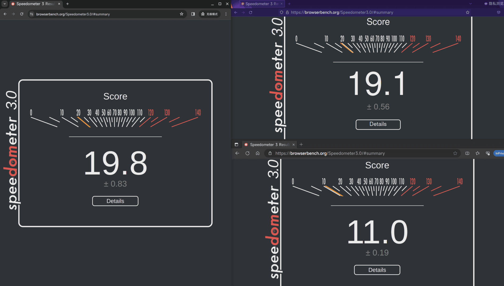
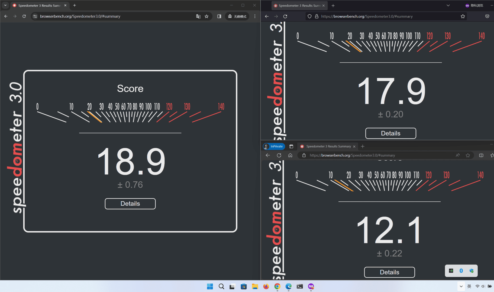
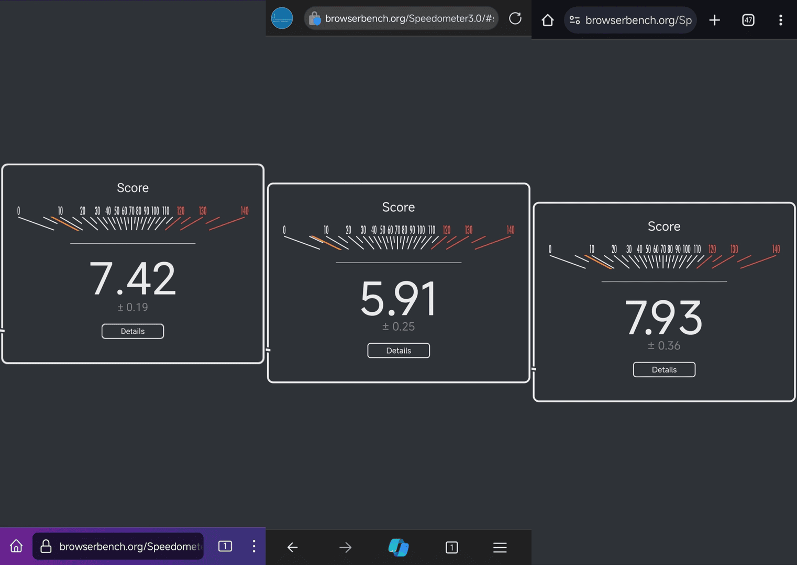
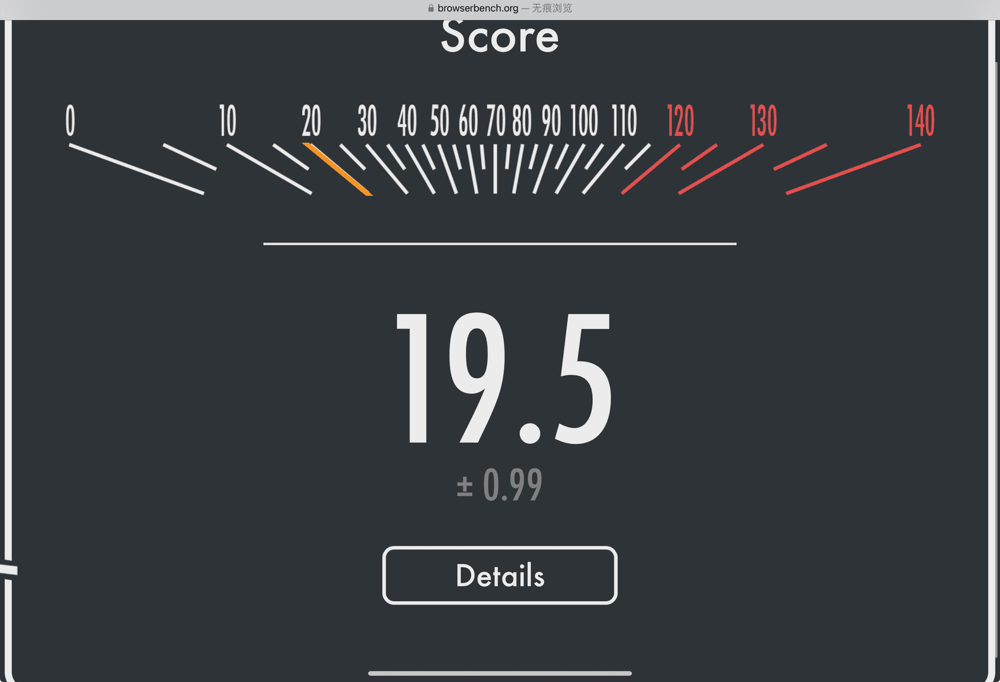
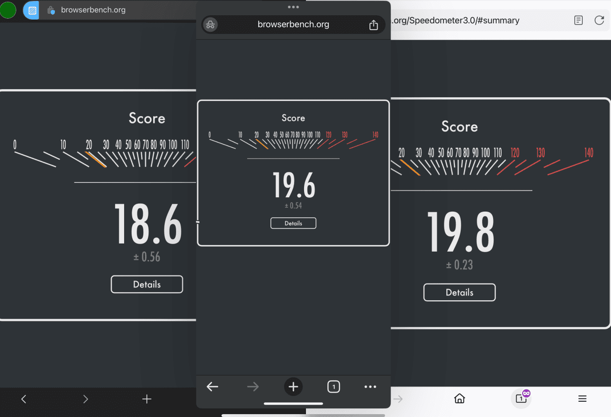

Date: 2024-03-12
Modified: 2024-03-12
Title: Speedometer 3.0分数测试(电子斗蛐蛐)
Tags: Arch, Linux, Windows, Software
Slug: Speedometer_3.0
category: Software

今天新的[Speedometer 3.0](https://browserbench.org/Speedometer3.0/) 浏览器基准测试发布了，据称其能更好的反应浏览器的现代负载，那么就直接测一测看看吧 ~~(电子斗蛐蛐)~~ !

 > 所有测试都是在隐私模式(防止插件干扰)下进行测试，测试平台笔记本Intel i7-11800H@4.600GHz，内存40GB@3200Mhz，安卓为小米13，苹果为ipad pro 2021

## 省流版本

同一硬件下Chrome不出意外地拿下最高分，Firefox紧随其后，Edge不出意外地以**绝对性优势**拿下第一名(倒数) :)。

(估计这得感谢巨硬去年持续往Edge堆广告等等垃圾玩意儿)

### PC端

PC端图片均为左Chrome,右上Firefox,右下Edge。
#### Arch Linux (Kernel 6.7.9)

| Chrome 122.0.6261 | Firefox 123.0.1 | Edge 122.0.2365 |
| ----------------- | --------------- | --------------- |
| 19.8 ± 0.83       | 19.1 ± 0.56     | 11.0 ± 0.19     |

#### Windows11

| Chrome 122.0.6261 | Firefox 123.0.1 | Edge 122.0.2365 |
| ----------------- | --------------- | --------------- |
| 18.9 ± 0.76       | 17.9 ± 0.20     | 12.1 ± 0.22     |

### 安卓

| Chrome Beta 123.0.6312 | Firefox 124.0b9 | Edge 122.0.2365 |
| ---------------------- | --------------- | --------------- |
| 7.93 ± 0.36            | 7.42 ± 0.19     | 5.91 ± 0.25     |

~~可以看到Edge非常稳定地差！~~
从左到右依次为Firefox,Edge,Chrome。

### 苹果

| Safari (ipadOS 17.4) | Safari (ipadOS 17.3) |
| -------------------- | -------------------- |
| 19.5 ± 0.99          | 10.9± 0.32           |

## 其他
ipad上大家用的内核都一样的情况下，Edge也依然一**寄**绝尘荣获倒数第一(果然就是垃圾东西塞多了是吧)🥰

(如下图，左Edge,中Chrome,右Firefox)

