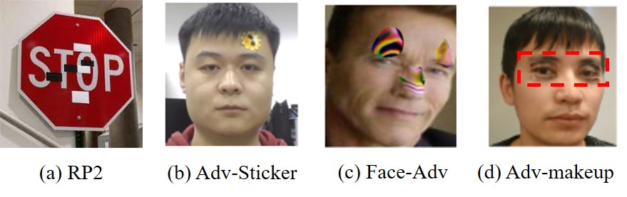

Recently, I've been researching attacks on AI systems for my final year project. Below is a brief overview of some of the research, mainly on newer adversarial attacks on computer vision and NLP.

<!-- more -->

## PDF File

**[Click here to view/dowload the PDF file](https://blog.menghuan1918.com/AlistStore/attacks%20AI%20system/slide.pdf)**

## Slide

Move the focus to the slide and press `F` to show it in full screen.

@slidestart

## Adversarial attacks on AI system

---

## Main areas of adversarial attacks
- Computer Vision
- Natural Language Processing
- Malware detection (not studied at the moment)

---

## Computer Vision
## Digital adversarial attack
- For example, in the medical field, the use of pass-by-image attacks (Using FGSM) can effectively interfere with existing disease prediction algorithms (most of  algorithms are based on ResNet-50)

[Zbrzezny, A. M., & Grzybowski, A. E. (2023). Deceptive tricks in artificial intelligence: Adversarial attacks in ophthalmology. _Journal of Clinical Medicine_, _12_(9), 3266.](https://pubmed.ncbi.nlm.nih.gov/37176706/)

---

##  Attacks in the OCR domain
- Watermarking attacks, for example, mimic the ink penetration of a scanner, thereby interfering with the recognition of OCR

- 

---

## Physical adversarial attack
- For example, using real stickers against a model attack

- 

---

## Physical adversarial attack
- Optical attacks (e.g. light exposure), a prominent non-invasive method. For example, the image below shows the addition of a translucent sticker in front of the camera.

- 
[Fang, J., Jiang, Y., Jiang, C., Jiang, Z. L., Liu, C., & Yiu, S. M. (2024). State-of-the-art optical-based physical adversarial attacks for deep learning computer vision systems. _Expert Systems with Applications_, 123761.](https://www.sciencedirect.com/science/article/abs/pii/S0957417424006274)

---

## Some possible attacks way
-  Fusion of low and high frequency information from two graphs
-  A variant algorithm of the traditional FGSM: adjusting the step size of each dimension to improve the efficiency of the attack[(Sun & Yu, 2024)](https://ieeexplore.ieee.org/document/10551750)
-  Combining with **graphical steganography**: using GAN to generate images as a backdoor to models[(Dong et al., 2023)](https://www.sciencedirect.com/science/article/abs/pii/S1568494623010116?via%3Dihub)

---

## NLP
## Attacks against tokenizer/NLP

-   Use a one-time gradient of all words to compute word salience(Adaptive Gradient-based Word Saliency), a relatively efficient method for creating adversarial text attacks, uses a one-time gradient of all words to compute word saliency[(Qi et al., 2024)](https://www.sciencedirect.com/science/article/abs/pii/S0925231224004387?via%3Dihub)
- HOMOCHAR:A black-box text confrontation framework, again at the character level[(Bajaj & Vishwakarma, n.d.)](https://www.sciencedirect.com/science/article/abs/pii/S0952197623009995?via%3Dihub)

---

## Attacks on MLLM
*Multimodal Large Language Model

- Attacks against positioning tasks, against MLLM can be made from graphics or input text[(Gao et al., 2024)](https://arxiv.org/abs/2405.09981)

---

## Attacks on MLLM
- Attack by generating adversarial images (relatively more likely to generate harmful information with separate inputs, which are initialized with random noise) against image prefixes that are optimized to maximize the generation of harmful content, followed by a problem that then embeds harmful semantics[(Wang et al., 2024)](https://arxiv.org/abs/2405.17894)

- 

---

## Common Attack Tools
### model attack
- Adversarial Robustness Toolbox
- Foolbox
- CleverHans
### Steganography
- OpenStego(steganography)
- text_blind_watermark(Text Blind Watermark)
- echo_watermark(audio watermark)

@slideend

## Text version

### Adversarial attacks on AI system

### Main areas of adversarial attacks
- Computer Vision
- Natural Language Processing
- Malware detection (not studied at the moment)

### Computer Vision
#### Digital adversarial attack
- For example, in the medical field, the use of pass-by-image attacks (Using FGSM) can effectively interfere with existing disease prediction algorithms (most of  algorithms are based on ResNet-50)

[Zbrzezny, A. M., & Grzybowski, A. E. (2023). Deceptive tricks in artificial intelligence: Adversarial attacks in ophthalmology. _Journal of Clinical Medicine_, _12_(9), 3266.](https://pubmed.ncbi.nlm.nih.gov/37176706/)

###  Attacks in the OCR domain
- Watermarking attacks, for example, mimic the ink penetration of a scanner, thereby interfering with the recognition of OCR

- 

### Physical adversarial attack
- For example, using real stickers against a model attack

- 

- Optical attacks (e.g. light exposure), a prominent non-invasive method. For example, the image below shows the addition of a translucent sticker in front of the camera.

- 
[Fang, J., Jiang, Y., Jiang, C., Jiang, Z. L., Liu, C., & Yiu, S. M. (2024). State-of-the-art optical-based physical adversarial attacks for deep learning computer vision systems. _Expert Systems with Applications_, 123761.](https://www.sciencedirect.com/science/article/abs/pii/S0957417424006274)

### Some possible attacks way
-  Fusion of low and high frequency information from two graphs
-  A variant algorithm of the traditional FGSM: adjusting the step size of each dimension to improve the efficiency of the attack[(Sun & Yu, 2024)](https://ieeexplore.ieee.org/document/10551750)
-  Combining with **graphical steganography**: using GAN to generate images as a backdoor to models[(Dong et al., 2023)](https://www.sciencedirect.com/science/article/abs/pii/S1568494623010116?via%3Dihub)

### NLP
#### Attacks against tokenizer/NLP

-   Use a one-time gradient of all words to compute word salience(Adaptive Gradient-based Word Saliency), a relatively efficient method for creating adversarial text attacks, uses a one-time gradient of all words to compute word saliency[(Qi et al., 2024)](https://www.sciencedirect.com/science/article/abs/pii/S0925231224004387?via%3Dihub)
- HOMOCHAR:A black-box text confrontation framework, again at the character level[(Bajaj & Vishwakarma, n.d.)](https://www.sciencedirect.com/science/article/abs/pii/S0952197623009995?via%3Dihub)

#### Attacks on MLLM
*Multimodal Large Language Model

- Attacks against positioning tasks, against MLLM can be made from graphics or input text[(Gao et al., 2024)](https://arxiv.org/abs/2405.09981)

#### Attacks on MLLM
- Attack by generating adversarial images (relatively more likely to generate harmful information with separate inputs, which are initialized with random noise) against image prefixes that are optimized to maximize the generation of harmful content, followed by a problem that then embeds harmful semantics[(Wang et al., 2024)](https://arxiv.org/abs/2405.17894)

- 

### Common Attack Tools
#### model attack
- Adversarial Robustness Toolbox
- Foolbox
- CleverHans
#### Steganography
- OpenStego(steganography)
- text_blind_watermark(Text Blind Watermark)
- echo_watermark(audio watermark)