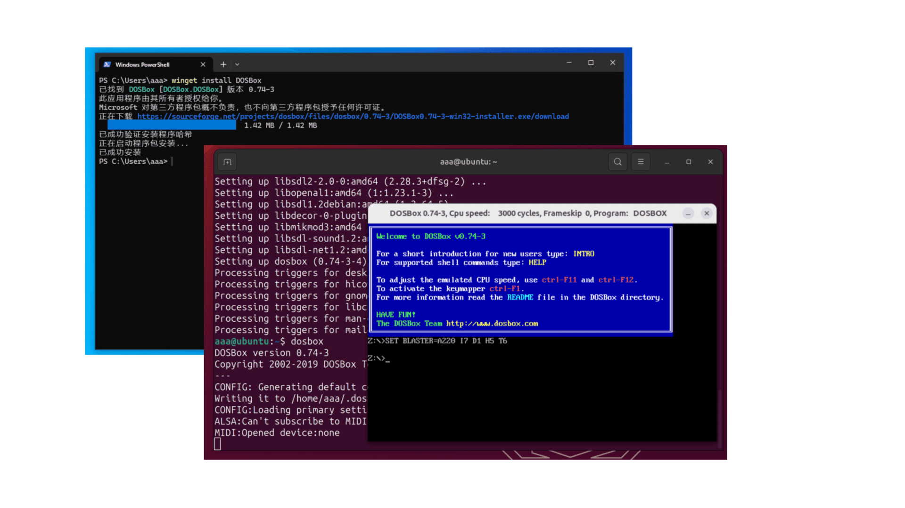
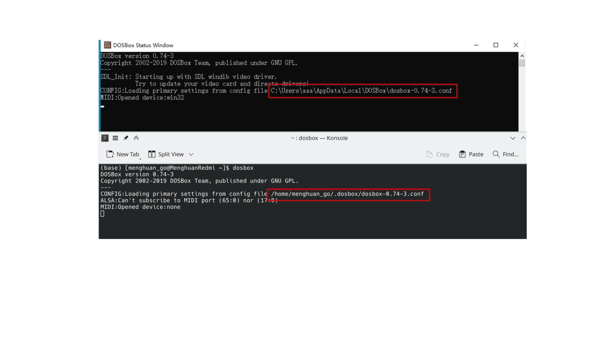
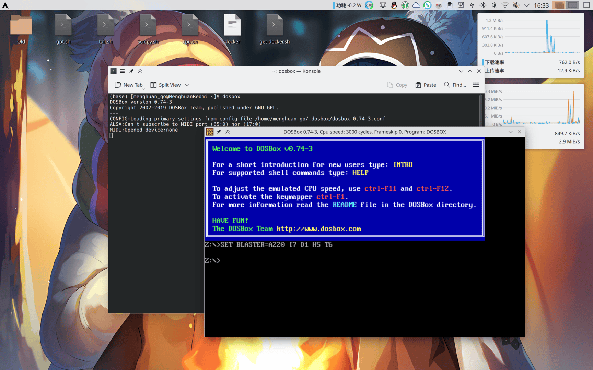
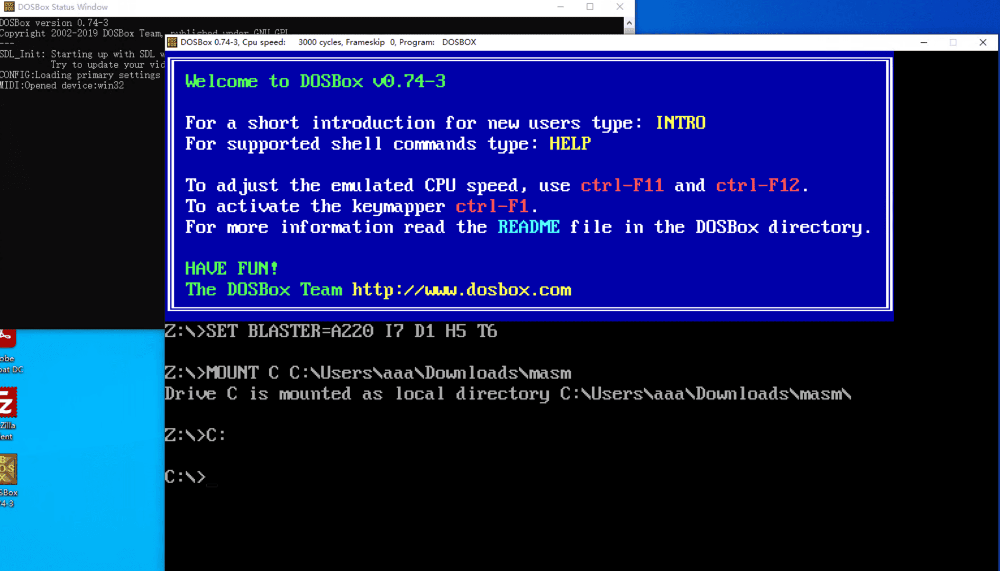
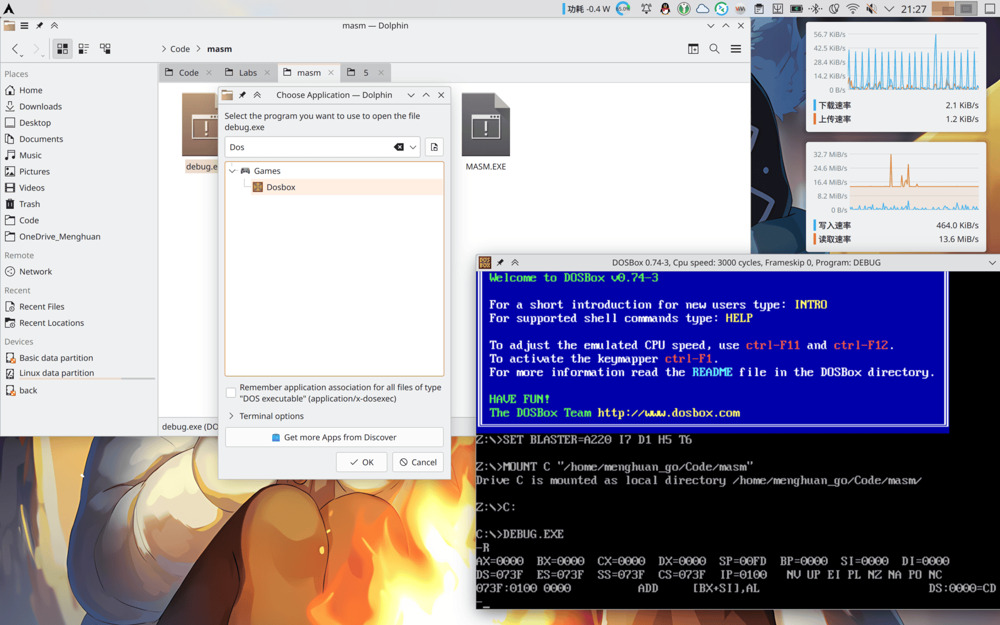

By default, DOSBox's window size is specified in pixels, which is a little bit too small for modern screens. It is not possible to drag and drop the window to resize it, although it is possible to use `alt + Enter` to switch it to full-screen mode, but for efficiency reasons it is better to resize the window.

<!-- more -->

## Install DOSBox
Use the Package Manager to install more **easily and quickly** on each system! Just open your Terminal/PowerShell and enter the command to install.

In particular, for Windows, its own package manager `winget` should be supported on Windows 10 1709 and above. If the `winget` command is not found, you can see [Microsoft's instructions for installing winget](https://learn.microsoft.com/en-us/windows/package-manager/winget/) or go directly to the [DOSBox website](https://www.dosbox.com/download.php?main=1) to download DOSBox and install it manually. 

::: code-tabs#install
@tab Windows

```powershell
winget install DOSBox
```
@tab Arch Linux

```bash
sudo pacman -S dosbox
```

@tab Ubuntu

```bash
sudo apt install dosbox
```
:::



## Configure window size



Note the directory of conf files loaded on the command line after startup (as shown above) and open it using a file editor.

### For Windows
Find about 30 lines where the change is made:

```conf
windowresolution=1280x1000
output=overlay
```

Where `windowresolution` is followed by the value of the window size you want to set. output You can fill in one of `overlay, opengl, openglnb, ddraw`.

### For Linux
Find about 30 lines where the change is made:

```conf
windowresolution=1920x1080
output=opengl
```

Where `windowresolution` is followed by the value of the window size you want to set.

Subsequent restart of DOSBox window size is mostly better.



## Setting up automatic mounting
Still with the configuration file mentioned above, scroll to the bottom and there is a part like：

```conf
[autoexec]
# Lines in this section will be run at startup.
# You can put your MOUNT lines here.
```

Just put the command you want it to execute automatically here. For example, if you want to mount a folder:

:::tabs#Set_mount
@tab Windows
[autoexec]

MOUNT C c:\masm

C:

@tab Linux
[autoexec]

MOUNT C ~/Code/masm

C:
:::



## For Linux...
For Linux, you can directly open the programme you want to run in DOSBox without doing a manual mount! Just right click on the programme you want to open, select **Open with another application** and then select **DOSBox**.



You can also use [this Github project](https://github.com/Menghuan1918/Useful-Tools) to interact with DOSBox in scripted form on Linux！Like showing in the [Vedio](https://blog.menghuan1918.com/AlistStore/DOSBox/dosbox.webm) below：

<VidStack
  src="https://blog.menghuan1918.com/AlistStore/d/opt/alist/data/store/opt/alist/data/store/DOSBox/dosbox.webm?sign=fJEv2gHHXV58X1CqJy2lHf9AMnW7ICVkxWyz1GWCEcc=:0"
/>

