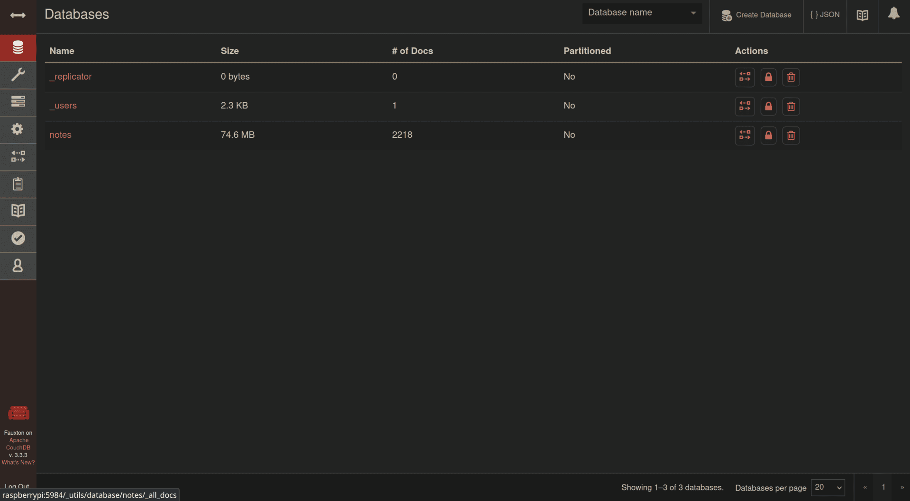
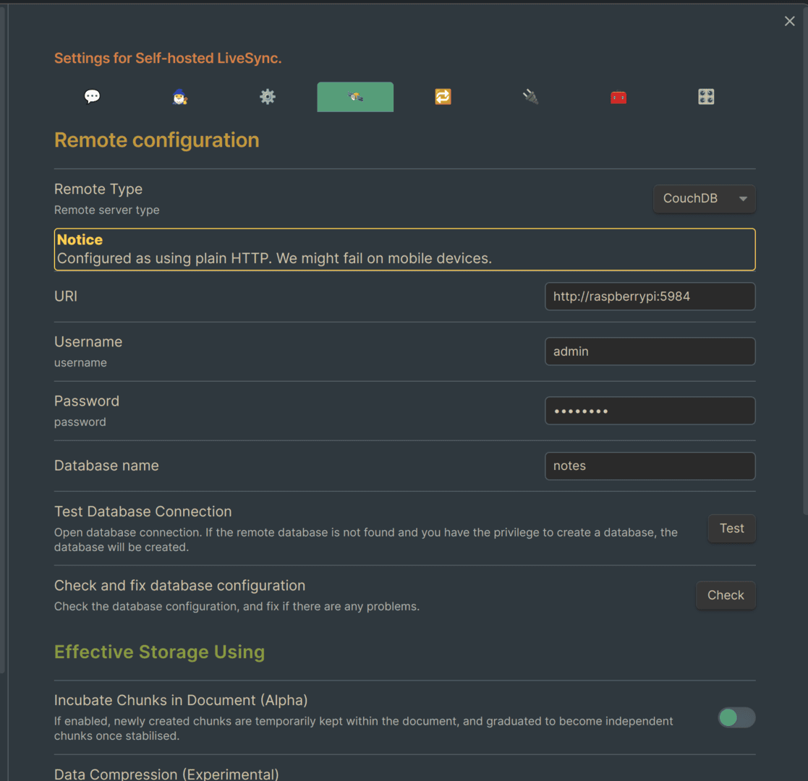
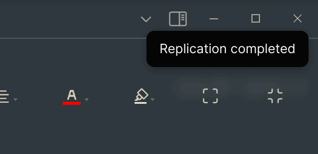
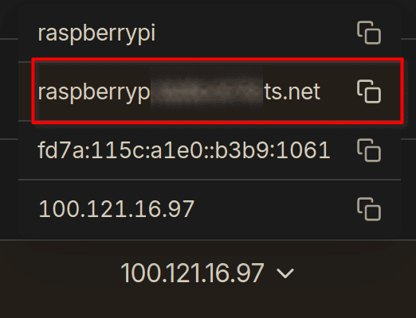
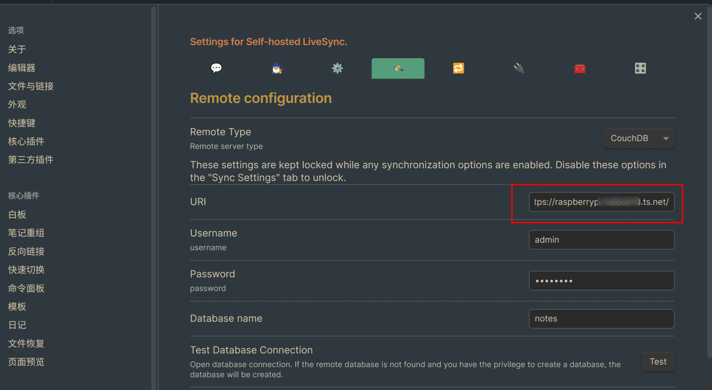

As the title is not so accurate, it should say that almost all notes are written in Obsidian, but some note that need handwritten still being written by OneNote, after all Obsidian doesn't official support handwritten.

And the difficulty to use **Self-hosted LiveSync** is to set up the HTTPS(needs domain name), without which mobile devices may not able to sync. Luckily, with (free version) taiscale, we do not need to buy **a domain name** or have a **public IP**!

<!-- more -->

> [!warning]
> Sync ≠ Backup! Even using this for synchronisation requires adequate backup!

## Set up Self-hosted LiveSync
Refer to [the ducument of the plugin](https://github.com/vrtmrz/obsidian-livesync/blob/main/docs/setup_own_server_cn.md)，find a place **where current user has write/read access**, and palce the files in below format：

```
obsidian-livesync
├── docker-compose.yml
└── local.ini
```

After copy the things from ducument, use `docker-compose up -d`to start. Hrer I chose to deploy on my Raspberry Pi(you can choose **any device** that can run Linux). Visit `http://raspberrypi:5984/_utils`, enter the username and passwd you set in `docker-compose.yml`, click the top right cornor to create a database, here I create a database `notes`.

> [!tip]
> Here ‘raspberrypi’ is the short domain name corresponding to the Raspberry Pi VLAN ip assigned in my tailscale, please replace it with the ip of the device you deployed.



## Test
Ok, before add the HTTPS, we should test it is working or ont. Install plugin `Self-hosted LiveSync`, set the database address userrname passwd ...:



Subsequently set up a real-time sync and see, considering that there are a lot of tutorials on this plugin I won't elaborate:



## Set up HTTPS
First, you need to have[tailscale](https://tailscale.com/download) in all your devices, just register and install with free plan version.

Then go to the web console of taisclae, find **DNS**->**HTTPS Certificates**, trun it on. We then need to use Caddy to reverse-substitute the local database's to the registered domain name provided by taiscale. The good news is that [Caddy supports automatically adding HTTPS to taiscale-provided domains](https://tailscale.com/kb/1190/caddy-certificates), so the whole process is made easy.

[Install Caddy](https://caddyserver.com/docs/install), and as I'm using Debian, need to edit `/etc/default/tailscaled`, add one line：

```txt
TS_PERMIT_CERT_UID=caddy
```

to make Caddy have access to the certificate, finally edit `/etc/caddy/Caddyfile`：

```txt
machine-name.domain-alias.ts.net {
        reverse_proxy localhost:5984
}
```

Note that `machine-name.domain-alias.ts.net` is replaced with the address of the domain given to you by taiscale. Then just reload it using `sudo systemctl reload caddy`.



Then return to Obsidian, replace it with https address.



The synchronisation established in this way is quite fast, refer to [this video](https://blog.menghuan1918.com/AlistStore/Obsidian%E5%90%8C%E6%AD%A5/speedtest.webm):

<VidStack
  src="https://blog.menghuan1918.com/AlistStore/d/opt/alist/data/store/opt/alist/data/store/Obsidian%E5%90%8C%E6%AD%A5/speedtest.webm?sign=IHAOHO-UJexhnsjEkfhIXpLmdWAf8E8O_EV2M_ltswc=:0"
/>