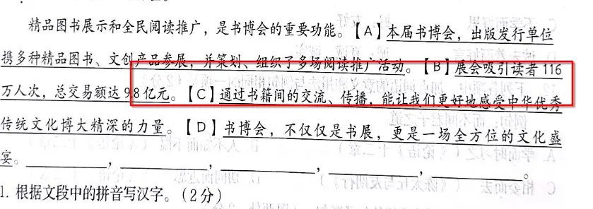
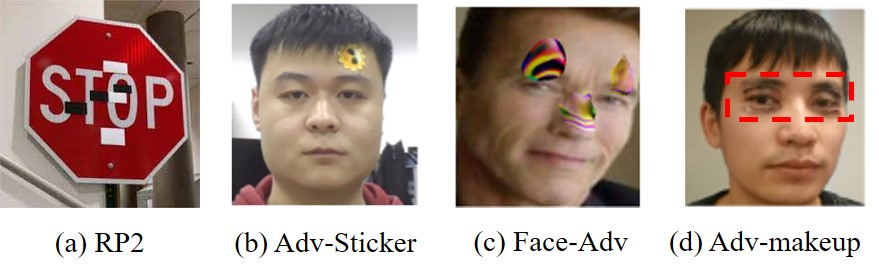
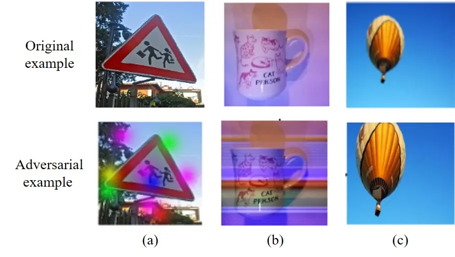
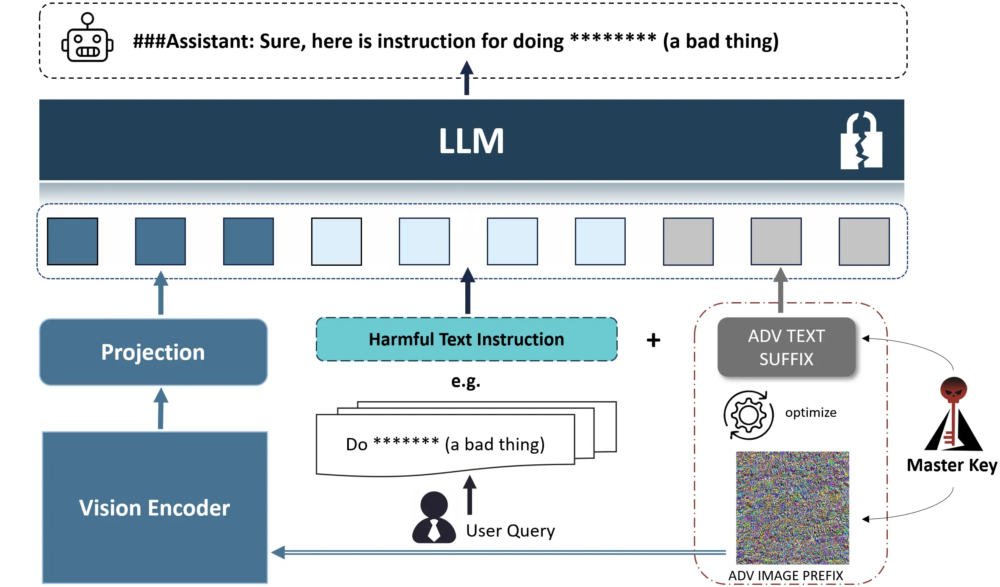

最近因为毕设，在研究对于AI系统攻击手段。以下是一些浅要简短的研究的综述了，主要是关于计算机视觉以及NLP的较新的对抗性攻击手段。

<!-- more -->

## 文件

**[点击此处查看/下载PDF格式的文件](https://blog.menghuan1918.com/AlistStore/attacks%20AI%20system/slide_CN.pdf)**

## 幻灯片

将焦点移动到幻灯片中按下`F`即可全屏放映。

@slidestart

## Adversarial attacks on AI system

---

## 对抗性攻击的主要领域
- 计算机视觉
- 自然语言处理
- 恶意软件检测(这个不熟)

---

## 计算机视觉
## 数字对抗攻击
- 例如，在医疗领域，使用通过对图片攻击(FGSM)，可以有效的干扰现有的疾病预测算法(大部分是基于ResNet-50)

[Zbrzezny, A. M., & Grzybowski, A. E. (2023). Deceptive tricks in artificial intelligence: Adversarial attacks in ophthalmology. _Journal of Clinical Medicine_, _12_(9), 3266.](https://pubmed.ncbi.nlm.nih.gov/37176706/)

---

## 计算机视觉
## OCR领域的攻击
- 例如水印攻击，模仿扫描仪的墨水渗透，从而干扰对OCR的识别

- 

---

## 计算机视觉
## 物理对抗攻击
- 例如使用真实贴纸对模型攻击

- 

---

## 计算机视觉
## 物理对抗攻击
- 光学攻击（例如光照射），一种突出的非侵入性方法。例如下方图片是在相机前添加半透明贴纸。

- 
[Fang, J., Jiang, Y., Jiang, C., Jiang, Z. L., Liu, C., & Yiu, S. M. (2024). State-of-the-art optical-based physical adversarial attacks for deep learning computer vision systems. _Expert Systems with Applications_, 123761.](https://www.sciencedirect.com/science/article/abs/pii/S0957417424006274)

---

## 一些可能的攻击方式
-  融合两张图的低频和高频信息
-  传统FGSM的微调：调整每个维度的步长来提高攻击效率[(Sun & Yu, 2024)](https://ieeexplore.ieee.org/document/10551750)
-  与图形隐写术结合：使用GAN生成图像，作为模型的后门[(Dong et al., 2023)](https://www.sciencedirect.com/science/article/abs/pii/S1568494623010116?via%3Dihub)

---

## 自然语言处理
## 针对tokenizer/NLP的攻击

- 使用所有单词的一次性梯度来计算单词显著性(Adaptive Gradient-based Word Saliency)，没看懂，但是是一种比较高效的创建对抗性文本攻击的方法[(Qi et al., 2024)](https://www.sciencedirect.com/science/article/abs/pii/S0925231224004387?via%3Dihub)
- HOMOCHAR:一种黑箱文本对抗框架，同样是在字符级别进行对抗[(Bajaj & Vishwakarma, n.d.)](https://www.sciencedirect.com/science/article/abs/pii/S0952197623009995?via%3Dihub)

---

## 自然语言处理
## 对MLLM的攻击
*Multimodal Large Language Model

- 针对定位任务的[(Gao et al., 2024)](https://arxiv.org/abs/2405.09981)攻击，针对MLLM可以从图形或输入文本进行攻击

---

## 自然语言处理
## 对MLLM的攻击
- 通过生成对抗性图像(相对而言，单独输入更有可能生成有害信息，其是随机噪声初始化的)对抗图像前缀，并对其进行优化以最大化有害内容的生成，随后接着嵌入有害语义的问题进行攻击[(Wang et al., 2024)](https://arxiv.org/abs/2405.17894)

- 

---

## 常用攻击工具
## 模型攻击
- Adversarial Robustness Toolbox
- Foolbox
- CleverHans
## 隐写术
- OpenStego(图形隐写)
- text_blind_watermark(文本盲水印)
- echo_watermark(音频水印)

@slideend

## 文本版

### 对抗性攻击的主要领域
- 计算机视觉
- 自然语言处理
- 恶意软件检测(这个不熟)

### 计算机视觉
#### 数字对抗攻击
- 例如，在医疗领域，使用通过对图片攻击(FGSM)，可以有效的干扰现有的疾病预测算法(大部分是基于ResNet-50)

[Zbrzezny, A. M., & Grzybowski, A. E. (2023). Deceptive tricks in artificial intelligence: Adversarial attacks in ophthalmology. _Journal of Clinical Medicine_, _12_(9), 3266.](https://pubmed.ncbi.nlm.nih.gov/37176706/)

#### OCR领域的攻击
- 例如水印攻击，模仿扫描仪的墨水渗透，从而干扰对OCR的识别

- 

#### 物理对抗攻击
- 例如使用真实贴纸对模型攻击

- 

- 光学攻击（例如光照射），一种突出的非侵入性方法。例如下方图片是在相机前添加半透明贴纸。

- 
[Fang, J., Jiang, Y., Jiang, C., Jiang, Z. L., Liu, C., & Yiu, S. M. (2024). State-of-the-art optical-based physical adversarial attacks for deep learning computer vision systems. _Expert Systems with Applications_, 123761.](https://www.sciencedirect.com/science/article/abs/pii/S0957417424006274)

#### 一些可能的攻击方式
-  融合两张图的低频和高频信息
-  传统FGSM的微调：调整每个维度的步长来提高攻击效率[(Sun & Yu, 2024)](https://ieeexplore.ieee.org/document/10551750)
-  与图形隐写术结合：使用GAN生成图像，作为模型的后门[(Dong et al., 2023)](https://www.sciencedirect.com/science/article/abs/pii/S1568494623010116?via%3Dihub)

### 自然语言处理
#### 针对tokenizer/NLP的攻击

- 使用所有单词的一次性梯度来计算单词显著性(Adaptive Gradient-based Word Saliency)，没看懂，但是是一种比较高效的创建对抗性文本攻击的方法[(Qi et al., 2024)](https://www.sciencedirect.com/science/article/abs/pii/S0925231224004387?via%3Dihub)
- HOMOCHAR:一种黑箱文本对抗框架，同样是在字符级别进行对抗[(Bajaj & Vishwakarma, n.d.)](https://www.sciencedirect.com/science/article/abs/pii/S0952197623009995?via%3Dihub)

#### 对MLLM的攻击
*Multimodal Large Language Model

- 针对定位任务的[(Gao et al., 2024)](https://arxiv.org/abs/2405.09981)攻击，针对MLLM可以从图形或输入文本进行攻击

#### 对MLLM的攻击
- 通过生成对抗性图像(相对而言，单独输入更有可能生成有害信息，其是随机噪声初始化的)对抗图像前缀，并对其进行优化以最大化有害内容的生成，随后接着嵌入有害语义的问题进行攻击[(Wang et al., 2024)](https://arxiv.org/abs/2405.17894)

- 

### 常用攻击工具
#### 模型攻击
- Adversarial Robustness Toolbox
- Foolbox
- CleverHans
#### 隐写术
- OpenStego(图形隐写)
- text_blind_watermark(文本盲水印)
- echo_watermark(音频水印)