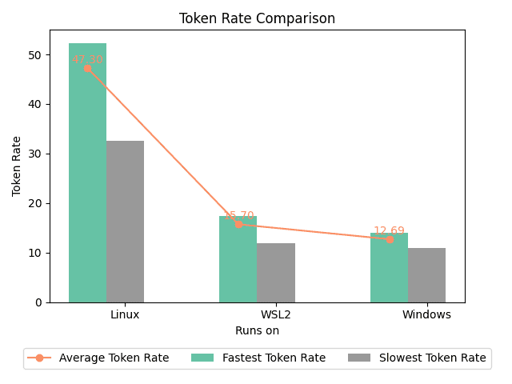
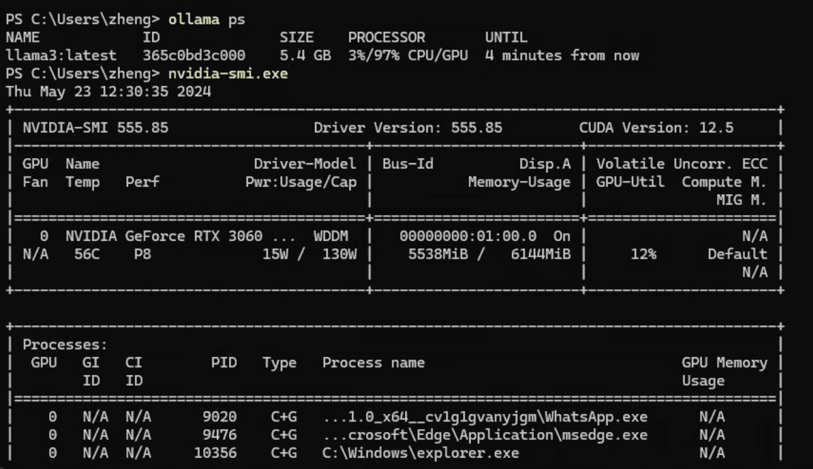

Ollama + llama3-8B基本可以满足基本的翻译工作了，并且其也能 _流畅_ 地在我的残血3060M上运行。当然，正如标题所言，这个流畅的前提是不在Windows下运行。

<!-- more -->

> 或者标题也可以改成："AI PC的拖油瓶：Windodws?"(手动滑稽)

## 结果以及猜测

本次测试平台：华硕天选二，11800H+残血3060M，40GB内存。其中Linux为Arch Linux，内核版本`6.9.1-arch1-1`，使用`nvidia-open`驱动。Windows为最新版Windows 11，WLS2为Ubuntu24.04，驱动均为最新。

使用的测试脚本是我自己写的，你可以在[这个储存仓](https://github.com/Menghuan1918/Useful-Tools?tab=readme-ov-file)找到：

观察两者的ollama运行日志，实际上很快就能发现问题所在：Windows上并没有将模型完全加载到GPU上！

虽然运行`nvidia-smi`会发现显存并没有占满，但是奇怪的是ollama并没有将这些显存给用尽。而在WSL2上也出现了同样的问题，无法完全占满显存。

## 河里的猜测

[参考这个issue](https://github.com/ggerganov/llama.cpp/issues/6442)，在部分加载到GPU上时Windows会显著慢于Linux，我自己实测也是这样，在使用llama.cpp部分加载模型到GPU，设置的层数相同的情况下Windows也会慢上几倍。~~不过这似乎并不能解释ollama在WLS2上为什么会更快~~

> PS:我在ollama上提了issue了...看会不会有后续