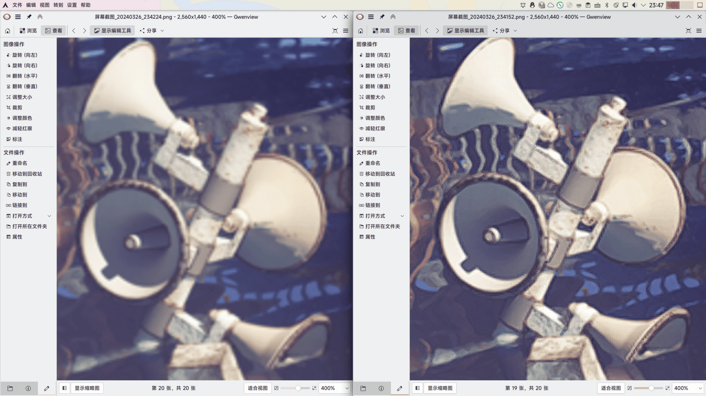
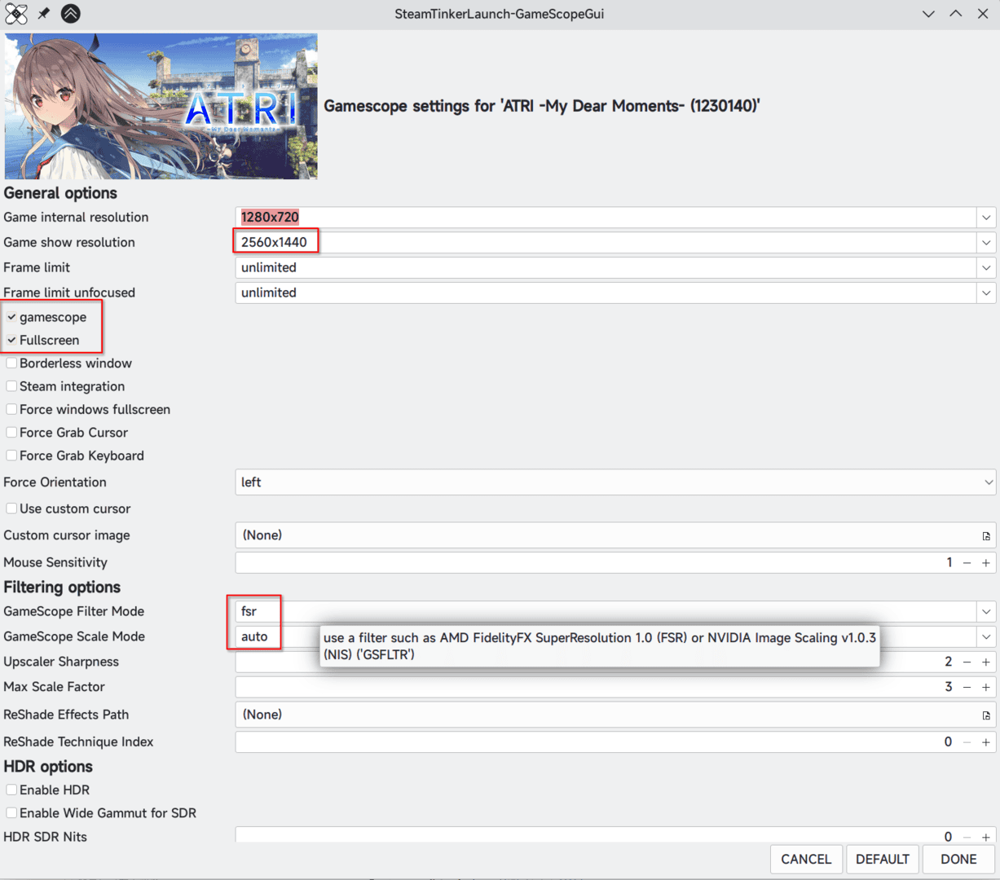

最近在玩《ATRI -My Dear Moments-》，然而其设计画质居然是720P，UI等等都没有对更高画质匹配 ~~这明明是2020年的游戏喂！~~。再外接一块2K屏幕(2560x1440)实在忍受不了，于是想起来是否能强制将其通过某种方式更为清晰化一些。

## Windows下很好的窗口缩放工具:Magpie

> 摘自其项目[README](https://github.com/Blinue/Magpie/blob/dev/README_ZH.md):
>
> 将任何窗口放大至全屏
>
> 众多内置算法，包括 Lanczos、Anime4K、FSR、Adaptive Sharpen、多种 CRT 着色器等
>
> 基于 WinUI 的用户界面，支持浅色和深色主题
>
> 为特定窗口创建配置文件
>
> 多屏幕支持

其也确实好用，~~唯一的问题是这是Windows软件~~。这个软件内置了多种放大算法，不过由于对于视觉小说游戏而言，只用使用FSR也就够了，毕竟涉及到文字阅读问题。当然要是只用Windows的话这个软件确实够用。不过幸运的是，如果仅仅是FSR的话Linux下也有相应的软件。

## Gamescope

>SteamOS session compositing window manager

[Gamescope](https://github.com/ValveSoftware/gamescope)是V社做的微合成器，其专注于游戏以及相关的功能(没错，就是Valve)。在Arch的extra仓库中可以找到它，理论上应当是开箱即用。如果你和我一样使用的N卡，请确保专有驱动版本在515.43.04+，并且设置好了内核参数`nvidia-drm.modeset=1`。

虽然其有很多功能，例如设置HDR，不过这次我需要的仅仅是进行FSR放大。参照其文档，将游戏从1280x720使用fsr放大到2560x1440，并以全屏展示，在steam的游戏启动属性中添加:

```bash
gamescope -w 1280 -h 720 -W 2560 -H 1440 -f -F fsr -- %command%
```

再启动就好啦！以下是关闭/开启FSR的对比:



## SteamTinkerLaunch

当然，我们也可以使用一些...更图形化的方法，比如[Steam Tinker Launch](https://github.com/sonic2kk/steamtinkerlaunch)。除了设置wine本身的参数之外，这个工具还可以设置GameScope，MangoHud，modding tools。从AUR中安装(或者其他方法安装)后，使用命令`steamtinkerlaunch compat add`将其添加到Steam兼容性工具中。随后在游戏属性中将使用的Steam Play兼容性工具调为Steam Tinker Launch就配置好了。启动游戏后应当会跳出一个管理窗口。

由于此处是调用Gamescope进行超分，因此直接进入相应页面设置:



随后确认修改，点击\[Play\]就好啦~

## 如果不用FRS呢

Gamescope实际上还支持NVIDIA Image Scaling，但是在这个游戏中实际效果惨不忍睹，整个屏幕都充满了奇奇怪怪的色彩(当然，这是因为原来的分辨率太小了，仅仅放大1.x倍的时候还是没啥大问题的)。

## 代价

那么，代价是什么呢？

答案当然是帧数！使用上方的设置，在变化复杂的场景帧数会跌到大约50帧(虽然对于视觉小说而言是完全可以接受的)。不过这估计也和原本的分辨率过低有关。不过至少再也不用忍受原本的超低分辨率了🥳