目前的Fastgpt，Dify(或者其他同类产品)，目前知识库召回的本质上还是分片块的文本，召回的还是文本信息。不过，我们可以进行一些预处理，提升其召回精度的同时，使其也能同时召回将图片与公式表格等内容。

<!-- more -->

## 原理以及实现

已经将下文提到的所有预处理方法加到[pdfdeal](https://menghuan1918.github.io/pdfdeal-docs/zh/guide/)包里啦(需要0.2.4或更高版本)，从PYPI上直接下载使用吧：`pip install --upgrade pdfdeal`

原理其实也很简单，对于原本的文档(假设是PDF格式)，将其通过转换工具将其转换为Markdown，再对MD文件进行一系列的预处理。整体而言分为三步：
- 转换文档，这一步中转换源文档中**公式**和整体**结构**，如果使用的工具足够强大，**表格**以及**纯图片**也应当被保留转换。
- 拆分段落，这一步将文本按照段落拆分开。对比普遍使用的滑动窗口拆分方式，其能显著加强分块内文本的相关度。
- 转换图片，这一步将不需要进行OCR的图片(例如示意图)，上传至云储存(例如阿里OSS，S3，云耀R2)，并以Markdown的形式的URL图片替换原有的位置。

> [!note]
> 题外话：上面说的纯图片是什么
> 
> 例如下图中蓝色方框部分是**表格**，应当进行表格识别(此处被识别为HTML格式的表格)，而红色方框部分则是展示的**原理图**，其**不**应当被进行OCR，而是应当保留下来。目前主流的转换工具应当都有能力保留。
> 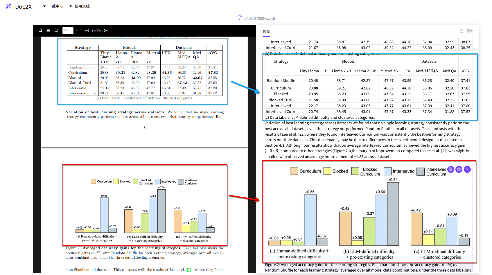

> [!warning]
> 从此处开始，默认你已经[安装了最新版的pdfdeal包](https://menghuan1918.github.io/pdfdeal-docs/zh/guide/)，并且你需要处理的PDF文件放置在`./Files`文件夹中。

## Step1：转换文档:PDF转Markdown

考虑[Doc2X](https://doc2x.noedgeai.com/)满足以上的所有需求，即文章结构/公式识别/表格识别/图片保留（~~以及免费~~），偷懒就直接用其进行转换了(同时也是`pdfdeal`包内置的方法)。

如果你想用其他方法，其他转换工具你可以参见我上一篇博文的[这一节](./graphrag_doc2x_deepseek.md#step1-转换pdf)。

> 上链接未带AFF，不过我建议你使用我的邀请码`4AREZ6`注册(滑稽)

```python
from pdfdeal import Doc2X
from pdfdeal.file_tools import get_files, unzips

Client = Doc2X()
out_type = "md"
file_list, rename_list = get_files(path="./Files", mode="pdf", out=out_type)
success, failed, flag = Client.pdf2file(
    pdf_file=file_list,
    output_path="./Output",
    output_names=rename_list,
    output_format=out_type,
)
print(success, failed, flag)

zips = []
for file in success:
    if file.endswith(".zip"):
        zips.append(file)

success, failed, flag = unzips(zip_paths=zips)
print(success, failed, flag)
```

你应当得到类似的输出：

```bash
['./Output/2408.07888v1.zip', './Output/1706.03762v7.zip'] [{'error': '', 'path': ''}, {'error': '', 'path': ''}] False
['./Output/2408.07888v1', './Output/1706.03762v7'] ['', ''] False
``` 

## Step2：拆分段落

大多数RAG应用都会提供自定义段落的功能，我们可以手动添加分隔符使其按照文章的段落进行分段，毕竟一般而言其都是滑动窗口分段(当然也有一些例外，后面会提到)。

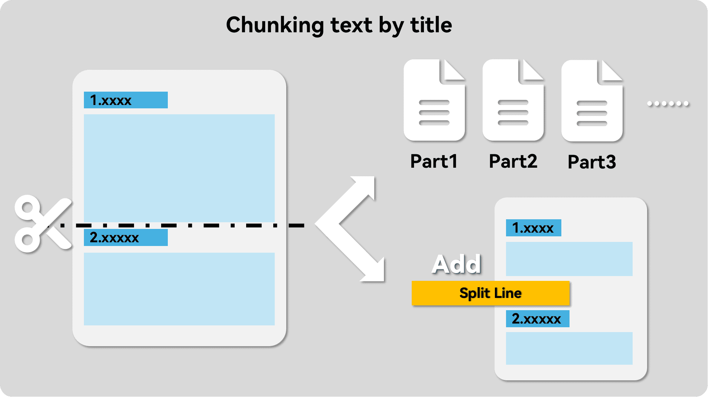

直接使用`pdfdeal`内置的方法，详细参照[此处](https://menghuan1918.github.io/pdfdeal-docs/zh/guide/Tools/Auto_split.html)。此处我直接使用的替换源文件。

```python
# 上接step1中的代码
from pdfdeal.file_tools import auto_split_mds

succese, failed, flag = auto_split_mds(mdpath="./Output", out_type="replace")
print(succese, failed, flag)
```

你应当得到类似的输出：

```bash
MD SPLIT: 2/2 files are successfully splited.
Note the split string is :
=+=+=+=+=+=+=+=+=
['./1/1706.03762v7.md', './1/2408.07888v1.md'] [{'error': '', 'file': ''}, {'error': '', 'file': ''}] False
```

此时再查看MD文档，可以看到其在各个分段直接已经添加上了分隔符了：

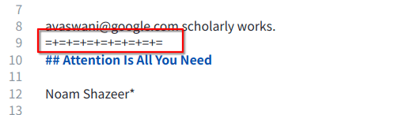

## Step3：转换图片为在线URL

到目前为止，图片的形式都还是以本地路径呈现的，其样式形如``。显而易见地，大部分RAG应用并不能显示这些图片,不过我们可以将其上传到云端储存服务从而使其能被召回。同样`pdfdeal`中也有相应的内置方法。

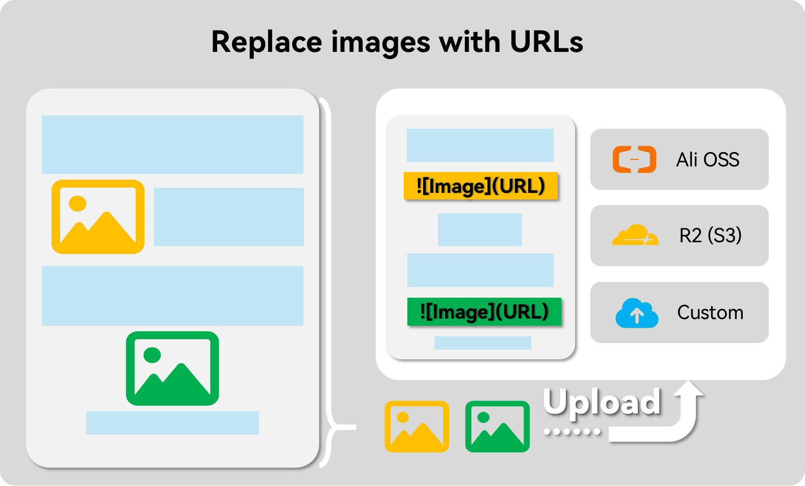

目前`pdfdeal`中内置有阿里OSS，云耀R2(其实就是S3协议)的上传方法，当然你也可以使用自定义的上传方程。

### 配置阿里OSS

此处选择使用阿里OSS，网上一堆开通的教程，自行搜索一下吧~ 其中以下是需要注意的一些权限问题：

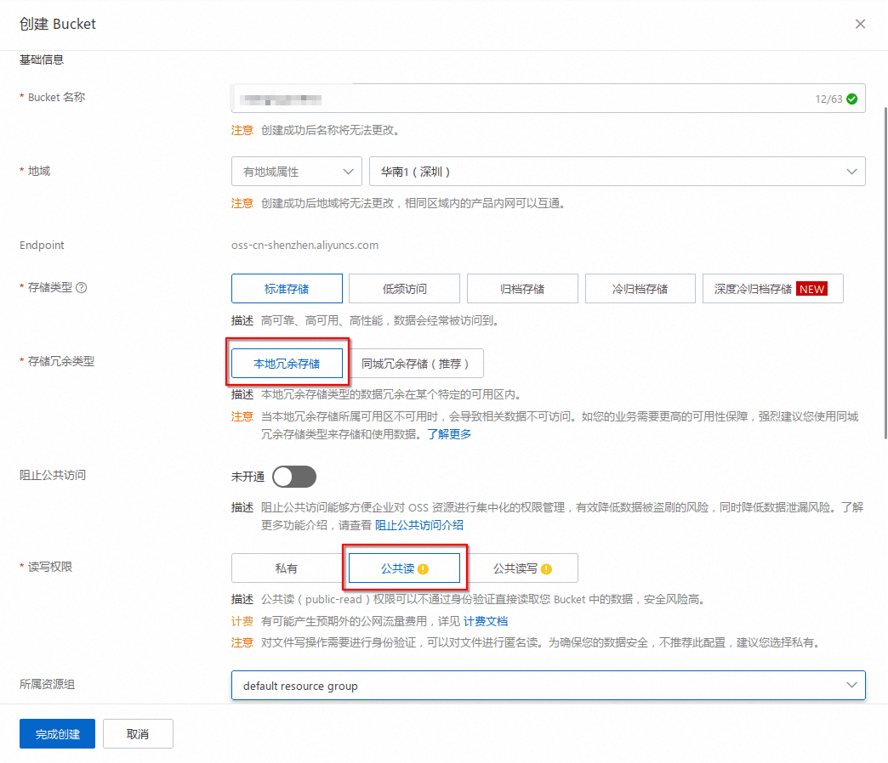

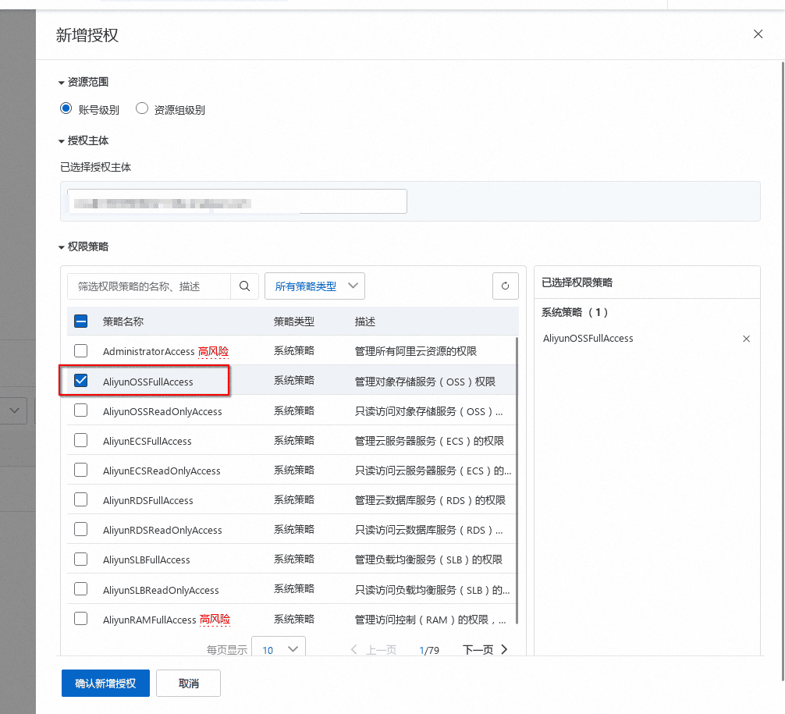

### 转换为URL

以下默认环境变量中已经有密匙啥的了，由于选用的是阿里OSS，额外再安装其包 `pip install -U oss2`：

```python
# 上接Step2中的代码
from pdfdeal.FileTools.Img.Ali_OSS import Ali_OSS
from pdfdeal.file_tools import mds_replace_imgs
import os

ossupload = Ali_OSS(
    OSS_ACCESS_KEY_ID=os.environ.get("OSS_ACCESS_KEY_ID"),
    OSS_ACCESS_KEY_SECRET=os.environ.get("OSS_ACCESS_KEY_SECRET"),
    Endpoint=os.environ.get("Endpoint"),
    Bucket=os.environ.get("Bucket"),
)

succese, failed, flag = mds_replace_imgs(
    path="Output",
    replace=ossupload,
    threads=5,
)
print(succese, failed, flag)
```

随后再查看MD文档，现在图片已经被替换为URL啦，其在大部分的RAG应用中召回时也能直接显示了：

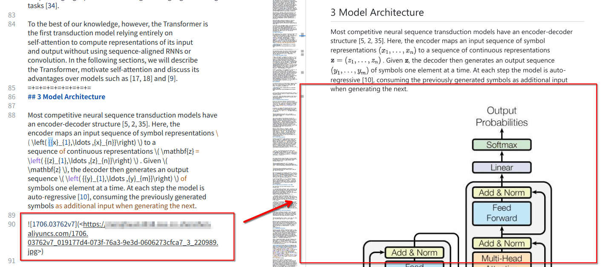

## 完整的程序

```python
from pdfdeal import Doc2X
from pdfdeal.file_tools import get_files, unzips, auto_split_mds, mds_replace_imgs
from pdfdeal.FileTools.Img.Ali_OSS import Ali_OSS
import os

Client = Doc2X()
out_type = "md"
file_list, rename_list = get_files(path="./Files", mode="pdf", out=out_type)
success, failed, flag = Client.pdf2file(
    pdf_file=file_list,
    output_path="./Output",
    output_names=rename_list,
    output_format=out_type,
)
print(success, failed, flag)

zips = []
for file in success:
    if file.endswith(".zip"):
        zips.append(file)
success, failed, flag = unzips(zip_paths=zips)
print(success, failed, flag)

succese, failed, flag = auto_split_mds(mdpath="./Output", out_type="replace")
print(succese, failed, flag)

ossupload = Ali_OSS(
    OSS_ACCESS_KEY_ID=os.environ.get("OSS_ACCESS_KEY_ID"),
    OSS_ACCESS_KEY_SECRET=os.environ.get("OSS_ACCESS_KEY_SECRET"),
    Endpoint=os.environ.get("Endpoint"),
    Bucket=os.environ.get("Bucket"),
)

succese, failed, flag = mds_replace_imgs(
    path="Output",
    replace=ossupload,
    threads=5,
)
print(succese, failed, flag)
```

## 接入RAG应用

### Fastgpt

按照正常的知识库导入流程，将上面得到的最后的Markdown文档导入，随后在第二步**数据处理**的时候选择自定义处理规则，填入分隔符：

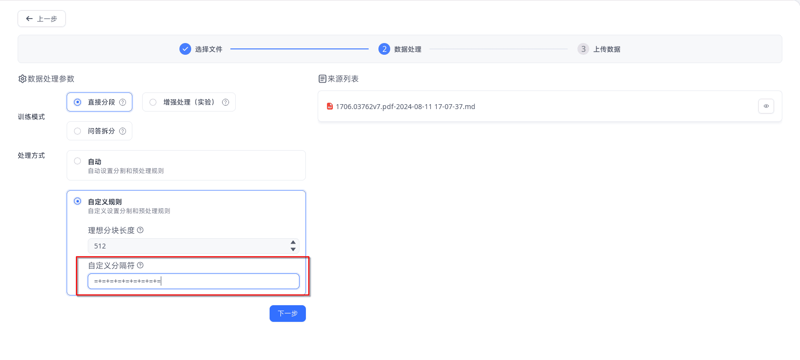

可以看到其数据中是严格按照段落分段的：

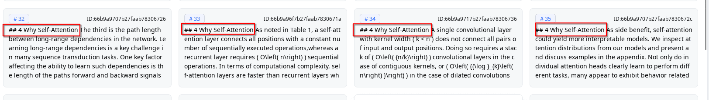

以下是一个召回的效果演示：

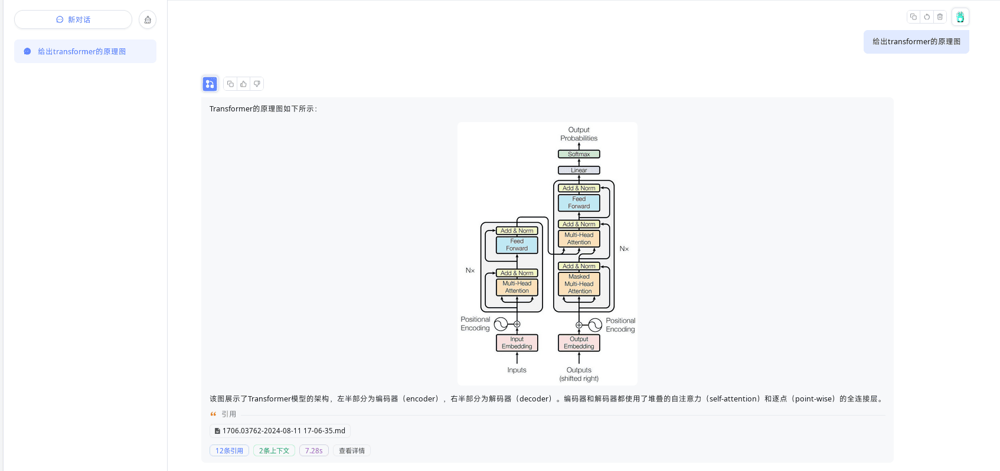

### Dify

> [!warning]
> 截止编写时的版本0.7.1，Dify对Markdown文件处理依然存在严重Bug，无论使用什么设置，其都会**自动删除**文件中的所有网址以及HTML标签。
>
> **请务必将md格式改为txt格式后上传！**
>
> 详细请参见这个[issue](https://github.com/langgenius/dify/issues/7228)

**首先将所有文件的md格式改为txt格式。**

随后按照正常的知识库导入流程，随后将上面得到的最后的**txt**文档导入，随后在第二步**数据处理**的时候选择自定义处理规则，填入分段标识符：

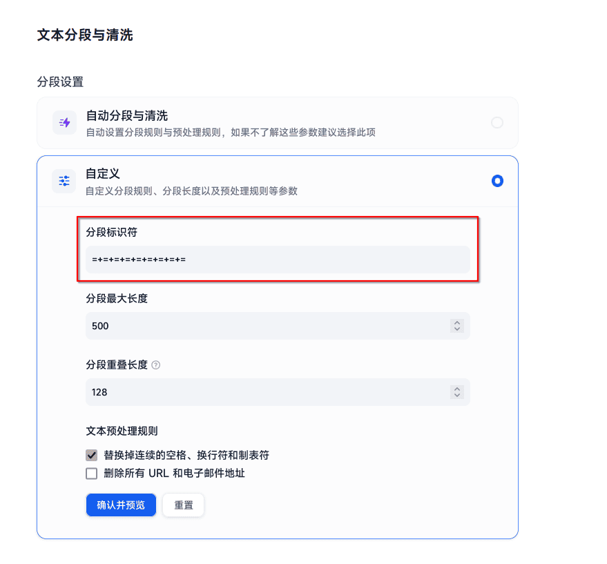

可以看到其数据中是严格按照段落分段的：

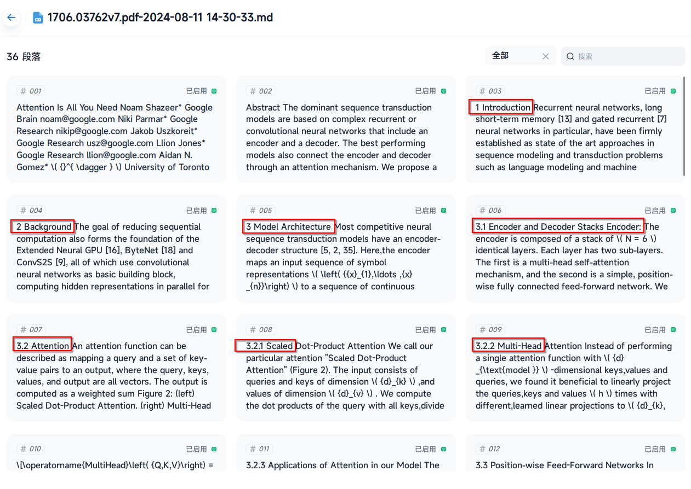

以下是一个召回的效果演示：

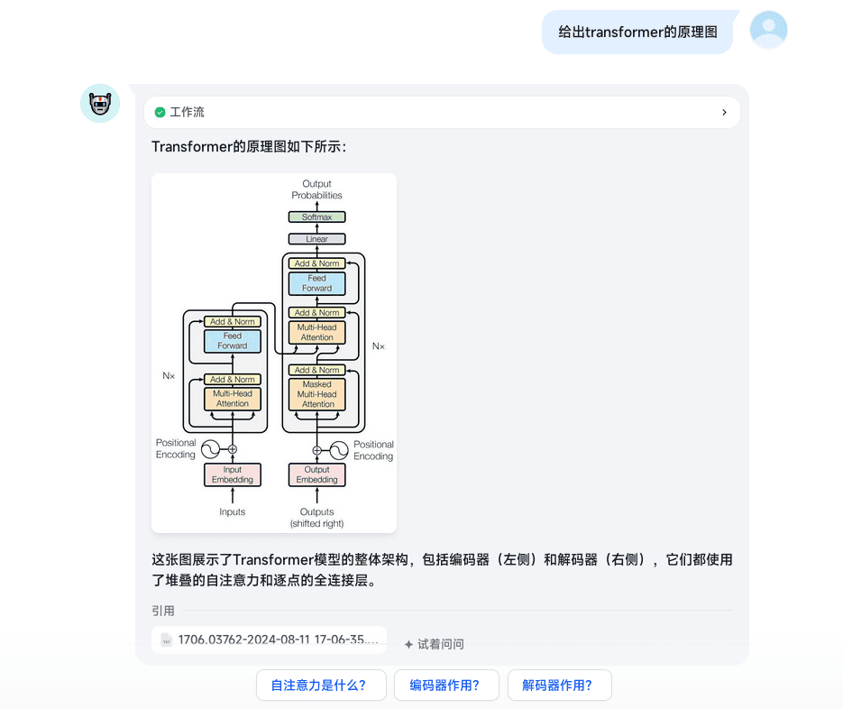

### 公式/表格召回

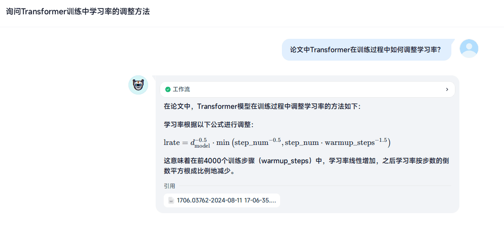

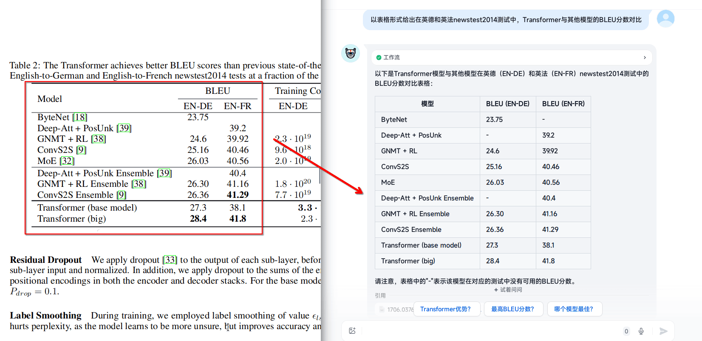

虽然其实，这俩能召回，是Doc2X的格式转换的功劳.....实际上和`pdfdeal`的文件预处理关系不是特别大💦

### 题外话：关于效果

实际上，Fastgpt有单独对Markdown文档做拆分的适配，你可以看到在上面的Fastgpt演示中，`#4`这一章节的内容较多，因此其被拆分为了几个分块。此时Fastgpt为这几个分块单独在开头添加了章节的标题(而Dify并没有，即使上传MD文档也是这样)。

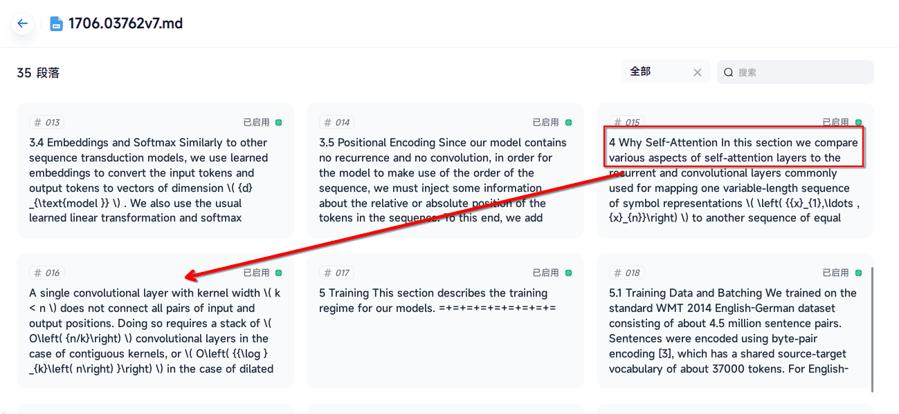

因此理论上**拆分段落**的一步对于Dify的效果提升是更为显著的，对于Fastgpt可能提升微小或者没有。