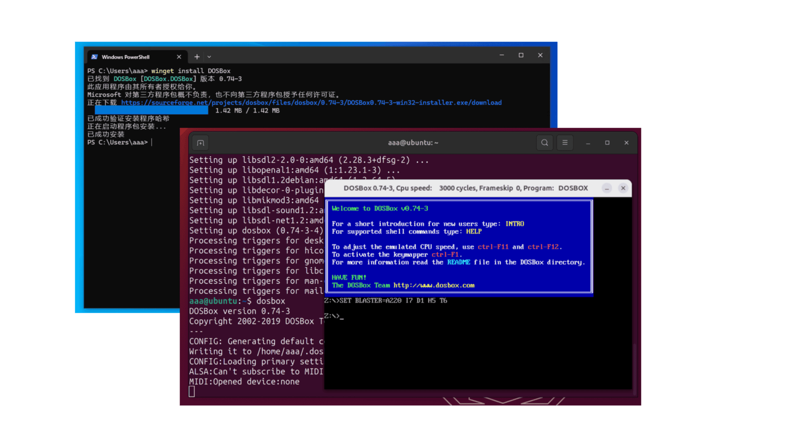
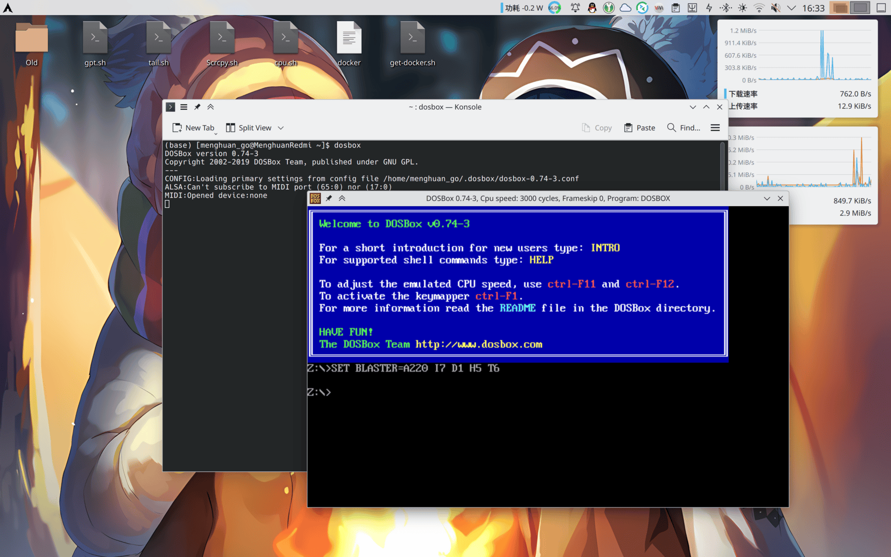
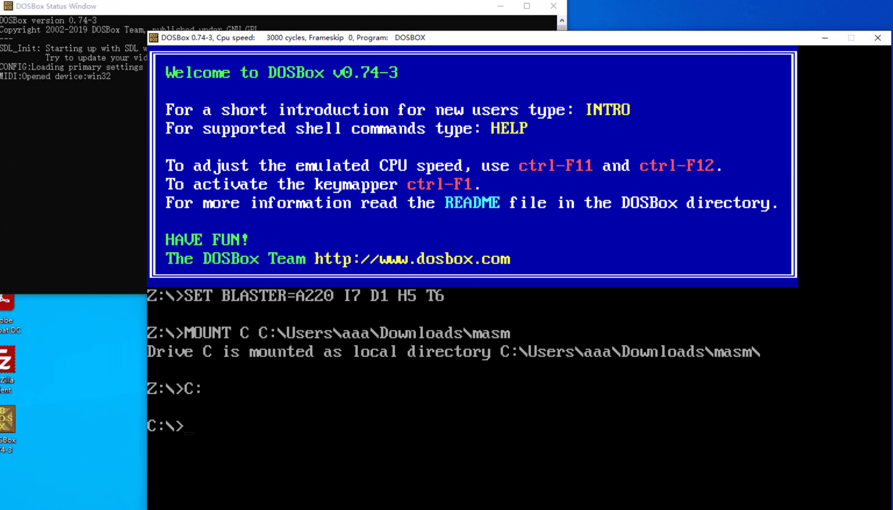

DOSBox默认情况下的窗口大小是由像素大小指定的，对于现代的屏幕而言稍微有亿点偏小了。并且其窗口还不能进行拖拽调整，虽然可以使用`alt + Enter`将其切换为全屏模式，不过考虑到效率问题还是调整其窗口大小更好一点。

<!-- more -->

## 安装DOSBox

使用包管理器来在各个系统上更**方便快捷**的安装！打开你的终端/PowerShell输入指令安装即可。

特别的，对于Windows，其自带的包管理器`winget`应当在Windows 10 1709以上的版本受支持。如果`winget`指令找不到，你可以参见[微软关于安装winget的说明](https://learn.microsoft.com/zh-cn/windows/package-manager/winget/)或者直接到[DOSBox网站](https://www.dosbox.com/download.php?main=1)下载DOSBox手动安装吧。

::: code-tabs#install
@tab Windows

```powershell
winget install DOSBox
```
@tab Arch Linux

```bash
sudo pacman -S dosbox
```

@tab Ubuntu

```bash
sudo apt install dosbox
```
:::



## 配置窗口大小


注意启动后命令行中加载的conf文件目录(如上图)，使用文件编辑器打开。

### 对于Windows
找到大约30行的地方，修改：

```conf
windowresolution=1280x1000
output=overlay
```

其中`windowresolution`后跟的值即是你想设置的窗口大小。output你可以从`overlay, opengl, openglnb, ddraw`中选一个填。

### 对于Linux
找到大约30行的地方，修改为：

```conf
windowresolution=1920x1080
output=opengl
```

其中`windowresolution`后跟的值即是你想设置的窗口大小。

随后再启动窗口大小就大多了。



## 设置自动挂载
依然是上方提到的配置文件，翻到最下方，有一个

```conf
[autoexec]
# Lines in this section will be run at startup.
# You can put your MOUNT lines here.
```

的部分，将你想让其自动执行的指令放在这儿即可。例如想要挂载文件夹：

:::tabs#Set_mount
@tab Windows
[autoexec]

MOUNT C c:\masm

C:

@tab Linux
[autoexec]

MOUNT C ~/Code/masm

C:
:::



## 对于Linux...
对于Linux，你可以直接打开要在DOSBox中运行的程序而无需进行手动挂载！只需要右键想要打开的程序，选择**使用其他应用打开**，再选择**DOSBox**即可。

