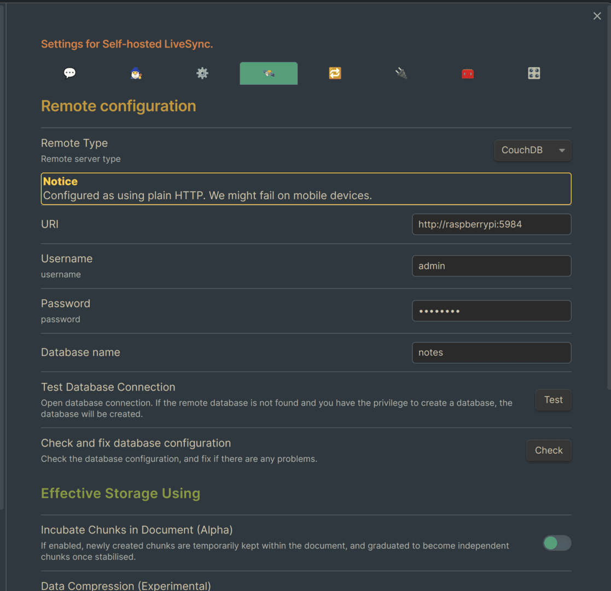

其实标题也不怎么准确，应当是说，主要的笔记现在都是使用Obsidian写，但是部分需要手写的笔记依然是在使用OneNote编写。毕竟Obsidian并没有官方的手写支持。

而Self-hosted LiveSync配置的难点在于HTTPS(以及域名)，没有HTTPS的话移动设备可能不能同步。不过幸运的是，使用(免费版的)tailscale，不需要**域名以及公网IP**即可完成这一切！

<!-- more -->

> [!warning]
> 注意：同步≠备份！即使使用这个进行同步也需要做好充足的备份工作！

## 配置Self-hosted LiveSync
这一部分参照[插件的文档](https://github.com/vrtmrz/obsidian-livesync/blob/main/docs/setup_own_server_cn.md)，找一个**你当前用户有读写权限**的地方，以如下格式放置好文件：

```
obsidian-livesync
├── docker-compose.yml
└── local.ini
```

随后`docker-compose up -d`启动容器。在此处我选择在我的树莓派上部署(你可以选择任意能运行Linux的设备)。部署完成后访问`http://raspberrypi:5984/_utils`，输入前面`docker-compose.yml`里设置好的账户密码，点击右上角创建一个数据库，我创建的数据库名字是`notes`。

> [!tip]
> 这儿‘raspberrypi’是我tailscale中分配的树莓派虚拟局域网ip对应的短域名，请替换为你部署的设备的ip


## 测试
当然，在加上HTTPS之前还是得先测试以下其是否是正常工作的。安装`Self-hosted LiveSync`插件，再填入之前设置的数据库地址名字等信息：



随后再设置实时同步一下看看，考虑到这个插件的教程很多就不再阐述了：


## 配置HTTPS
首先你需要在你的所有设备中配置好了[tailscale](https://tailscale.com/download)，注册安装即可。

随后前往taisclae的网页控制台，找到**DNS**->**HTTPS Certificates**，将其打开。随后我们需要使用Caddy将本地数据库的反代到taiscale提供的注册域名上。好消息是，[Caddy支持自动为taiscale提供的域名添加HTTPS](https://tailscale.com/kb/1190/caddy-certificates)，因此整个过程就变得简单起来了。

首先[安装Caddy](https://caddyserver.com/docs/install)，同时由于我使用的是Debian系统，还需要编辑`/etc/default/tailscaled`，在其末尾添加一行：

```txt
TS_PERMIT_CERT_UID=caddy
```

来使得Caddy有权限获得证书，最后编辑`/etc/caddy/Caddyfile`：

```txt
machine-name.domain-alias.ts.net {
        reverse_proxy localhost:5984
}
```

注意`machine-name.domain-alias.ts.net`替换为taiscale给你的域名地址，随后使用`sudo systemctl reload caddy`重载即可。


随后返回Obsidian，替换为https的地址即可。


这样建立起来的同步速度相当快，可以参考[这个视频](https://blog.menghuan1918.com/AlistStore/Obsidian%E5%90%8C%E6%AD%A5/speedtest.webm)

<VidStack
  src="https://blog.menghuan1918.com/AlistStore/d/opt/alist/data/store/opt/alist/data/store/Obsidian%E5%90%8C%E6%AD%A5/speedtest.webm?sign=IHAOHO-UJexhnsjEkfhIXpLmdWAf8E8O_EV2M_ltswc=:0"
/>

## 其他
这个插件也是看到[有佬推荐才用的](https://linux.do/t/topic/65783)，试了几天，发现确实好用。