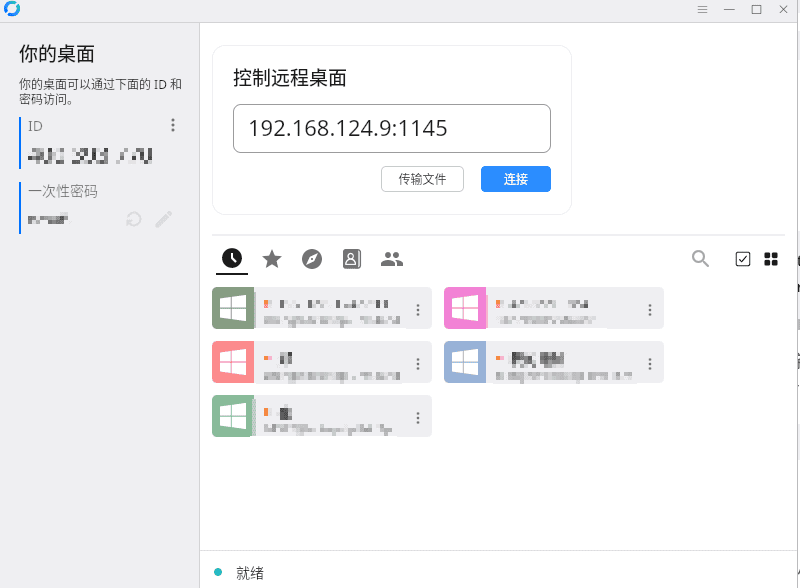

## 在服务器上使用Docker部署RustDesk中续

由于我有[两台电脑](https://blog.menghuan1918.com/intro.html)，虽然日常都是通过tailscale穿透后ssh连接，但是总还是偶有需要远程操控的地方。很显然RustDesk提供的服务器就亚洲而言延迟有点高了，因此自己动手部署一个中续服务器。依然在是前文提到的阿里云香港轻量应用服务器，Ubuntu 22.04上部署。

### 安装Docker

虽然可以选择官方源进行安装.....但是当时用了阿里云镜像进行安装docker(埋坑了):

```bash
curl -fsSL https://mirrors.aliyun.com/docker-ce/linux/ubuntu/gpg | apt-key add -
add-apt-repository "deb [arch=amd64] https://mirrors.aliyun.com/docker-ce/linux/ubuntu $(lsb_release -cs) stable"
apt-get update
apt-get install docker-ce docker-ce-cli containerd.io docker-compose
```

由于我直接用的root用户登录所以并没加sudo。随后找一个你喜欢的地方创建RustDesk的docker-compose.yml文件吧，此处文件参照[官方文档](https://rustdesk.com/docs/zh-cn/self-host/rustdesk-server-oss/install/):

```yml
version: '3'

networks:
  rustdesk-net:
    external: false

services:
  hbbs:
    container_name: hbbs
    ports:
      - 21115:21115
      - 21116:21116
      - 21116:21116/udp
    image: rustdesk/rustdesk-server:latest
    command: hbbs -r <Your IP>:21117 -k _
    volumes:
      - ./data:/root
    networks:
      - rustdesk-net
    depends_on:
      - hbbr
    restart: unless-stopped
    deploy:
      resources:
        limits:
          memory: 64M

  hbbr:
    container_name: hbbr
    ports:
      - 21117:21117
    image: rustdesk/rustdesk-server:latest
    command: hbbr -k _
    volumes:
      - ./data:/root
    networks:
      - rustdesk-net
    restart: unless-stopped
    deploy:
      resources:
        limits:
          memory: 64M
```

>此处我添加了`-k _`以阻止没加密key的用户进行连接

随后cd到响应的地方，`docker-compose up -d`就可以用了....?

### 解决依赖问题

随后立即就得到一堆报错，其中最为关键的几处报错为:

```python
TypeError: request() got an unexpected keyword argument 'chunked'
docker.errors.DockerException: Error while fetching server API version: request() got an unexpected keyword argument 'chunked'
```

随后搜索定位到为[这个issue中提到过](https://github.com/docker/docker-py/issues/3113?utm_source=pocket_saves)，原因为pip包`requests`更新导致的接口变化，后续版本有修复。查看服务器上的docker-compose版本为1.29.2-1.....(~~是不是有点过于旧了~~)，考虑别的地方暂时也没使用`requests`，将其降级草草解决问题:

```bash
pip install requests<2.2.29
```
随后再重新启动，这次一切正常了。在RustDesk中填入中续服务器的ip以及`id_ed25519.pub`作为密匙就好了。



## 将网页从pelican切换为vuepress

考虑到前者对markdown的支持实在是有点过于折腾，花了两个多小时切换到了vuepress。效果相当的好!由于两者都是以Markdown为基础，所以迁移过程无非就是改了改配置文件就完了。

> 除了首页的图标`heroImage`貌似只能读取svg文件以外...最开始尝试的png图片，老是报错还以为是路径。

### 改进的更新脚本

随着写的文章多起来了(指加上这篇水文也才4篇)，开始有往文章里面插入图片的需求了。于是在原先的更新脚本中插入了一个[对特定文件夹图片进行压缩](https://github.com/Menghuan1918/WebPage/blob/main/Images.sh)的脚本。

```bash
./Images.sh
```

对这个文件夹中所有文件进行遍历，如有.done结尾的标示文件则代表已经被压缩，如没有则压缩并标记。