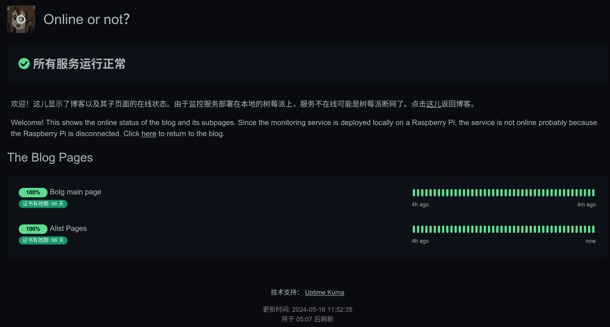

本文内容：
- 部署一个网页在线状态面板到子域名
- 将网站反代服务切换到Caddy

<!-- more -->

## 部署一个网页在线状态面板
使用[uptime-kuma](https://github.com/louislam/uptime-kuma)可以轻松简单地部署一个网页在线状态面板~就是下面这个：



当然还是使用docker-compose部署，改写下官方给的docker指令：

```yml
version: "3.3"
services:
  uptime-kuma:
    restart: always
    ports:
      - 3001:3001
    volumes:
      - uptime-kuma:/app/data
    container_name: uptime-kuma
    image: louislam/uptime-kuma:1
volumes:
  uptime-kuma: {}
```

启动之后进去按步骤设置就好了。随后再将其反代到子域名上，再往网站的标题栏加一个按钮就行了。

当然这玩意儿也就图一乐呵乐呵，树莓派或者服务器两个哪个没网都会显示服务异常(怎么感觉更像是树莓派在线状态面板?)。

## 将反代切换到Caddy
~~Caddy真香，配置对比Nginx而言简单太多了~~

首先[安装Caddy](https://caddyserver.com/docs/install)，随后编辑`/etc/caddy/Caddyfile`：

```Caddyfile
blog.menghuan1918.com {
    root * /var/www/menghuan
    file_server
    encode gzip

    handle_errors {
        @404 {
            expression {http.error.status_code} == 404
        }
        rewrite @404 /404.html
        file_server
    }

    tls /etc/ssl/menghuan1918.pem /etc/ssl/menghuan1918.key

    route /AlistStore* {
        reverse_proxy http://127.0.0.1:5244
    }
}

www.menghuan1918.com, menghuan1918.com {
    redir https://blog.menghuan1918.com{uri} permanent
}

status.menghuan1918.com {
        reverse_proxy raspberrypi:3001
        tls /etc/ssl/menghuan1918.pem /etc/ssl/menghuan1918.key
}
```

> [!tip]
> 这儿‘raspberrypi’是我tailscale中分配的树莓派虚拟局域网ip对应的短域名，参见[前文部署插件Self-hosted LiveSync](https://blog.menghuan1918.com/posts/Set_up_LiveSync_Obsidian.html)

就是简单地反代：本地静态网页，Alist网盘并指定证书，以及将子域名反代到面板上。