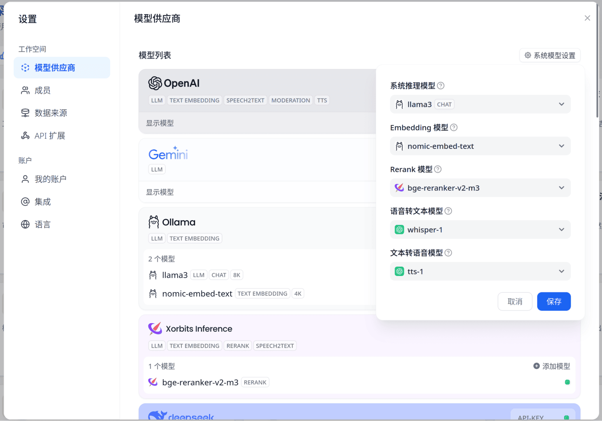

记录下运用Dify + xinference + ollama打造带**重排序**(Rerank)步骤的知识库问答，更好的是----即使在我的3060M上其也能**完全本地**运行并有不错的效果！3060M本地运行`llama3-9B`的生成速度参照[前文](https://blog.menghuan1918.com/posts/Drag_on_AI_PC_may_be_Windows.html)。

<!-- more -->

## 部署

理论上如果不需要使用重排序(Rerank)功能的话，仅使用ollama和dify就足够了。但是使用重排序确实能将检索准确度提升很多，因此这儿我同时也部署了xinference以本地部署重排版模型。

### 部署Dify

这个相对简单，按照其官方说明：

```bash
git clone https://github.com/langgenius/dify.git
cd dify/docker
docker compose up -d
```

随后访问本地的`http://localhost`根据网页提示进行一步步设置就行了。

### xinference
创建一个docker-compose.yaml：

```yaml
services:
  xinference:
    image: xprobe/xinference:v0.11.2
    environment:
      - XINFERENCE_HOME=/root/.xinference
      - HUGGING_FACE_HUB_TOKEN=hf_114514
    volumes:
      - /mnt/Games/Model:/root/.xinference
    ports:
      - "9998:9997"
    deploy:
      resources:
        reservations:
          devices:
            - capabilities: [gpu]
    command: xinference-local -H 0.0.0.0
```
注意这儿我挂载了一个`volumes`上去以将模型文件保存在本地(否则每次容器重启都要下载一次)，以及定义了`HUGGING_FACE_HUB_TOKEN`，这样就可以从🤗上拉取一些需要权限访问的模型(比如llama3)了。

### 快捷启动

再写一个简单的bash脚本快捷启动这两个容器：

```bash
#!/bin/bash
cd /home/menghuan/Documents/Xinference
echo "Xinference"
docker compose up -d
echo "dify"
cd /home/menghuan/Documents/dify
docker compose up -d
sleep 10
curl -X 'POST' \
  'http://127.0.0.1:9998/v1/models' \
  -H 'accept: application/json' \
  -H 'Content-Type: application/json' \
  -d '{
  "model_engine": "xinference",
  "model_uid": "bge-reranker-v2-m3",
  "model_name": "bge-reranker-v2-m3",
  "gpu_idx": 0,
  "model_type": "rerank"
}'
echo "done!"
```

当然你也可以将其设置为开机启动后自动运行这两个脚本。

## 配置Dify

随后就是配置Dify了。这个过程没什么好说的，唯一值得注意的是xinference的模型UID默认情况下是等于其模型名字的。随后更改系统模型设置，这决定了默认情况下会使用什么模型，当然你也可以针对单个工作流/知识库自定义其聊天/向量化模型。



随后从模板创建一个知识库(芝士学爆！)，选择多路召回以使用重排版。


> [!important]
> 注意上图中**N选1召回**中含有一个对整个工作流默认LLM的全局选项！没想到藏在这儿

随后就尽情想用芝士学爆吧：


## 题外话：对PDF文件的预处理

值得注意的是dify并没有对pdf进行预处理(例如OCR)，检索一圈发现好像确实也没什么特别好的库或者方法...于是自己[搓了一个](https://github.com/Menghuan1918/pdfdeal)，其会先对PDF中的图片进行OCR，随后处理下文本并按照原有页数输出。不过其设计的目标就是为增强知识库的索引...所以以格式pdf输出时其格式可能对人类不是特别友好(不过知识库能完全读取)。至少个人测试其效果很不错。

安装，这儿使用`easyocr`作为OCR引擎(当然你也可以自定义OCR函数)：

```bash
pip install 'pdfdeal[easyocr]'
```

随后对我`./PPT`的文件处理下：

```python
import os
from pdfdeal import deal_pdf
for root, dirs, files in os.walk("./PPT"):
    for file in files:
        file_path = os.path.join(root, file)
        deal_pdf(
            input=file_path, output="pdf", language=["en"], path="./Output", GPU=True
        )
        print(f"Deal with {file_path} successfully!")
```

这样的PDF文件索引起来就准确多了。

## 题外话：电子邮件

既然 LLM/向量编码/重排版 模型都能本地运行，那么是不是一些隐私文件(例如：电子邮件)是否也能接入知识库呢？感觉可行(立个Flag先)，后面抽空研究下。