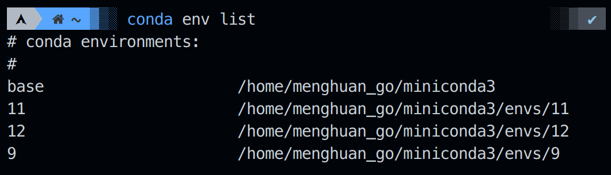
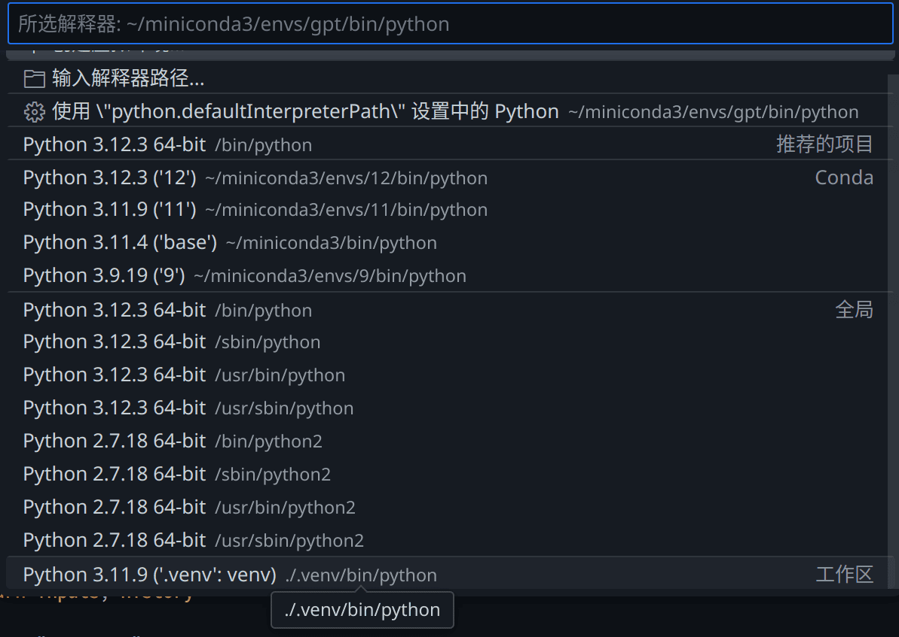
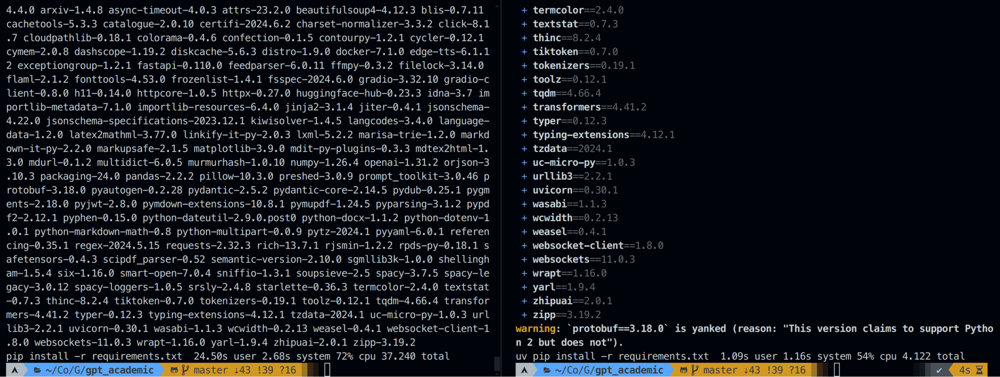
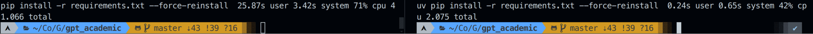
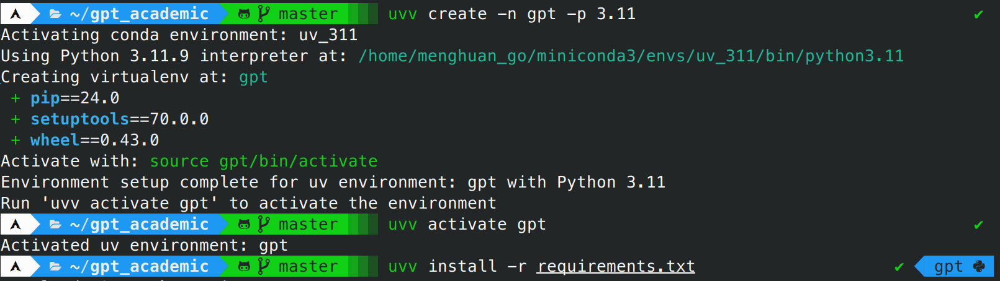
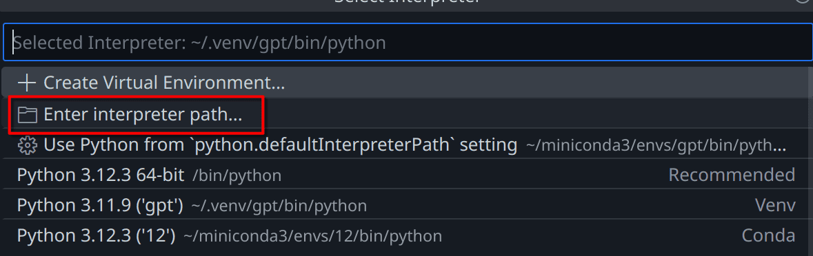

UV，作为新一代的，**性能极佳**的Python的包安装器和解析器，其网上中文教程却寥寥无几...

由于其目前并不支持自行下载多版本的Python，这篇文章记录下我借用conda的多版本Python支持，与uv结合，使得能实际使用中完全替代conda。

也算半个UV使用教程了把(大概)。
<!-- more -->

你可以直接看到`对比：以gpt_academic为例`一节，其能说明所有的折腾都是值得的。

## 安装

### miniconda3

首先安装下miniconda，**其作用是提供多个版本的Python给uv使用，而不是真的要用conda**，好消息是不管在Linux上还是Windows上都可以很方便的安装。

> miniconda你可以看为是Anaconda的精简版，仅带有其命令行。

::: code-tabs#install
@tab Windows
```powershell
winget install --id=Anaconda.Miniconda3 -e 
```

@tab Linux
当然你也可以去官网下载并安装，或者通过你的包管理器。

```bash
mkdir -p ~/miniconda3
wget https://repo.anaconda.com/miniconda/Miniconda3-latest-Linux-x86_64.sh -O ~/miniconda3/miniconda.sh
bash ~/miniconda3/miniconda.sh -b -u -p ~/miniconda3
rm -rf ~/miniconda3/miniconda.sh
```
:::

随后使用`conda init 你用的命令行工具`进行初始化，例如`conda init bash`。当然你也可以直接`conda init --all`全都给初始化。

### uv

随后安装下uv：

::: code-tabs#install
@tab Windows
```powershell
powershell -c "irm https://astral.sh/uv/install.ps1 | iex"
```

@tab Arch Linux
```bash
sudo pacman -S uv
```

@tab Linux
```bash
curl -LsSf https://astral.sh/uv/install.sh | sh
```
:::

## 使用前配置

> [!info]
> 如果你打算用我创建的[uvv工具](https://github.com/Menghuan1918/uvv)，你可以忽略这两节。

前面已经提到了，uv的虚拟环境并不像conda一样能提供多版本的Python。不过其可以借用conda的python。因此我们创建几个conda环境(为了给uv提供不同版本的python)。我常用的Python版本是`3.9`，`3.11`，`3.12`，因此我创建了对应的环境：

```bash
conda create -n 9 python=3.9
conda create -n 11 python=3.11
conda create -n 12 python=3.12
```



随后设置取消自动激活conda环境，这是因为这会与uv虚拟环境冲突：

```bash
conda config --set auto_activate_base false
```

随后就让我们进入实战环节吧。

## 如何替换conda

例如，我有一个项目需要使用Python 3.11版本，依赖储存于`requirements.txt`中，要运行`main.py`。

那么如果我们使用conda，一般其流程是：


```bash
conda create -n gptac_venv python=3.11
conda activate gptac_venv
python -m pip install -r requirements.txt
python main.py
```

而如果我们使用`uv`的话，其流程就是：

```bash
conda activate 11
uv venv --seed -p 3.11
conda deactivate
uv pip install -r requirements.txt
source ./.venv/bin/activate
python main.py
```

> [!warning]
> 注意上文中的`conda deactivate`，不要同时激活uv虚拟环境和conda虚拟环境！

## 在VSCode中使用

就和正常的venv虚拟环境一样使用。

如果你还想使用ipynb，建议自己先安装内核`uv pip install jupyter`




## 对比：以gpt_academic为例

gpt_academic也算是一个依赖众多的项目了，这儿对比下uv和pip的速度。这个过程中网速并不是限制因素(校园网没抽风，下载速度都是80Mb/S起步)：



正如其所说的，确实快了数十倍(37.24s vs 4.122s)。

而当一个包在同版本Python的环境中安装过一次时，uv就能使用其缓存进行加速安装了，非常高速高效(41.066s vs 2.075s)！



这是因为uv会使用全局的缓存，只要在全局范围内安装过的包再安装就会起飞一样安装完成。

## 使用上的优化

这样的uv还是在每个文件夹创建.venv文件夹，还是得找一个办法和conda一样能全局使用才方便。

于是为了真正达到替换conda的效果，我编写了一些脚本来替换，你可以在[这个GitHub储存仓](https://github.com/Menghuan1918/uvv)找到这个脚本。使用如下命令来加载这个脚本：

```bash
git clone https://github.com/Menghuan1918/uvv
cd uvv
sh Install.sh
```

使用上几乎只需要将`conda`替换为`uvv`即可，例如以上文的例子：

```bash
uvv create -n gpt -p 3.11
uvv activate gpt
uvv install -r requirements.txt
```



不过在VSCode中你需要手动选择一下...好在其会记忆这个位置，不会每次都要重选一下。

例如这儿我创建的是名为`gpt`的环境，我需要手动选择下环境位置为：

`/home/menghuan_go/.venv/gpt/bin/python`

