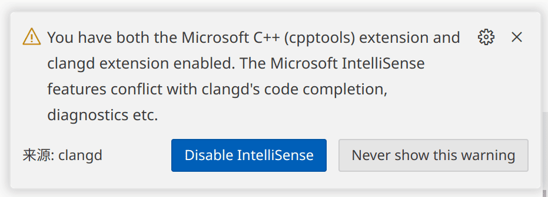
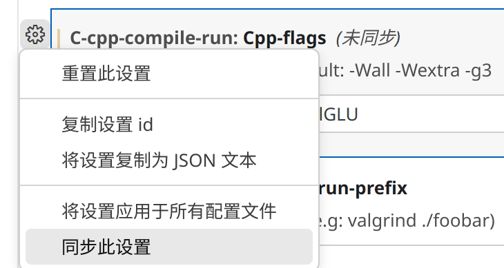
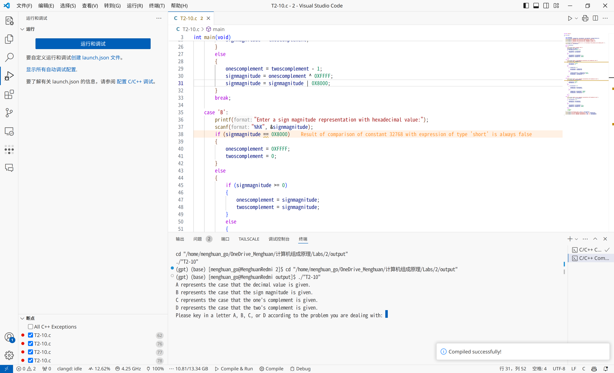
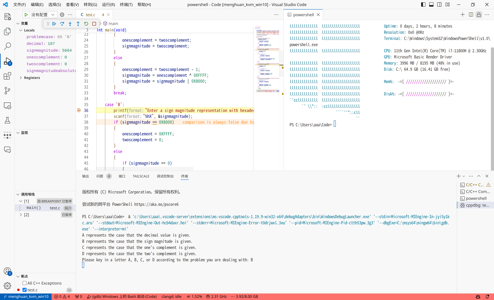
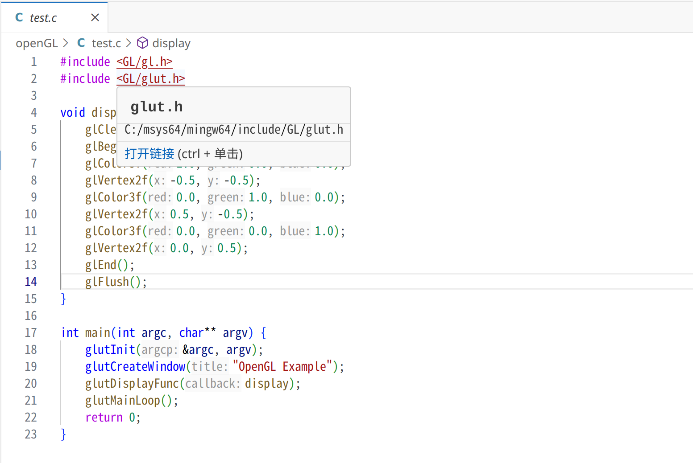

这么多年的(插件)发展之后，实际上在VSCode中配置C/C++语言已经不是一件很困难的事情了，一般而言，所需要做的仅仅是安装`C/C++`插件，**理论**上其会自动检测编译器并生成响应的配置文件。

当然这只是理论，一旦涉及到跨平台同步(例如自带的设置同步，或者共用一个文件夹)就麻烦起来了，因为Linux和Windows的设置并不通用。此外微软开发的`C/C++`插件还存在一些问题，例如只会显示错误(Error)不会显示警告(Warning)等等，不过好在VSCode的众多插件提供了解决方案，其即能跨平台同步设置又补足了之前的缺点，同时在**Windows**和**Linux**下使用起来简单快捷。

<!-- more -->

## 前置环境配置

当然一切的前提是拥有一个C/C++编译器。对于Windows而言最简单的方法应该是使用MSYS2进行配置，详细参见[这篇文章](https://blog.menghuan1918.com/posts/Windows_env_opengl.html)。

随后还需要安装clangd语言服务器协议以提供更好的语法检查。为了避免找不到路径的尴尬情况，**不要**使用VSCode的`clangd`插件提供的一件安装服务

> 对于MSYS2包，可以在[这个网站](https://packages.msys2.org/queue)搜索

::: code-tabs#gcc

@tab Arch Linux

```bash
sudo pacman -Syu
sudo pacman -S gcc
sudo pacman -S gdb
sudo pacman -S clang
```

@tab Ubuntu

```bash
sudo apt update
sudo apt install gcc
sudo apt install gdb
sudo apt install clangd
```

@tab Windows

```bash
# 确保你已经配置了MSYS2
pacman -Syu
pacman -S mingw-w64-x86_64-gcc
pacman -S mingw-w64-x86_64-clang-tools-extra
pacman -S mingw-w64-x86_64-gdb
```

:::

## VSCode中配置

安装以下插件：

`C/C++ Extension Pack`

`C/C++ Compile Run`

`clangd`

你也可以使用`ctrl+p`快捷键呼出快速命令窗口使用以下命令安装：

```VSCode
ext install ms-vscode.cpptools-extension-pack

ext install danielpinto8zz6.c-cpp-compile-run

ext install llvm-vs-code-extensions.vscode-clangd
```

随后你应该能看到来自插件`clangd`的提示，选择禁用来自微软`C/C++`插件的语言服务。否则在语法补全或者查看变量/函数类型等等时会同时看到来自这两个插件的提示。



对于`C/C++ Compile Run`插件理论上不需要进行任何配置，由于其编译依然是调用`gcc`或者`g++`进行编译，而前文对于Windows中MSYS2安装时已经配置好了环境变量。不过你也可以在额外设置一些编译的标识。



> `C/C++ Extension Pack`插件是用来对C/C++调试支持的，不能删掉(不止有语法高亮的功能)。

## 效果

当然这儿还额外使用了一个插件`Error Lens`来将警告和错误直接显示在编辑器中。







至此，就已经配置好了有语法警告提示，能在多平台上开箱即用简单快捷的VSCode了！