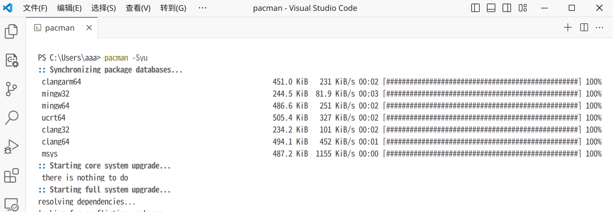
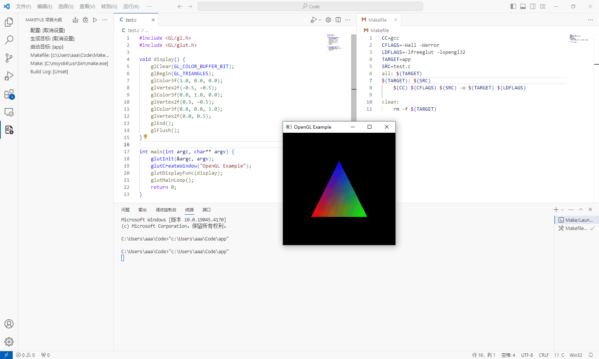

众所周知，在windows上配置一些软件(例如GCC，openGL，make...)是相当困难繁琐的，不过好在也不是没有解决方法。比如[MSYS2](https://www.msys2.org/)，它提供了一个类Unix的构建环境，可以像在linux上一样安装软件包，而不需要你一个一个手动设置环境变量等等工作(不过是windows平台的)。

这次就使用MSYS2进行配置GCC/make/openGL以及flex/bison的开发环境。相比手动安装每一个工具，这种方法尤为简便快捷。

<!-- more -->

## 安装并设置环境变量

在官网上下载安装运行程序，直接按照其默认的安装路径进行安装(即C:\msys64)。MSYS2默认提供了很多环境进行选择，这儿我选择使用mingw64环境。为了能在PowerShell中使用(而不是其自带的mintty终端)以方便远程链接，将MSYS以及MINGW64的执行文件添加到环境变量中。

选择：设置->系统->关于->高级系统设置->环境变量->PATH->添加

添加上`C:\msys64\mingw64\bin`和`C:\msys64\usr\bin`


随后应该就能在PowerShell中使用MSYS64自带的包管理器pacman(~~吃豆人~~)了。基本操作可以参照[Arch Wiki的内容](https://wiki.archlinuxcn.org/wiki/Pacman#%E5%AE%89%E8%A3%85%E8%BD%AF%E4%BB%B6%E5%8C%85)。

例如一些基本操作：

```bash
pacman -Syu
# 更新软件包源以及软件包
pacman -Ss xxx
# 搜索名为xxx的软件包
pacman -S xxx
# 安装名为xxx的软件包
pacman -Rs xxx
# 卸载软件包xxx以及其相关的依赖
```



## 安装GCC/make/openGL

随后就是轻松愉快的包安装环节了，没有更多的环境变量需要配置，只需要执行指令就完成安装了~

```bash
pacman -S mingw-w64-x86_64-gcc
pacman -S make
pacman -S mingw-w64-x86_64-freeglut
```

随后验证一下是不是安装好了：


## 安装Lex和Yacc

这两个工具的GUN替代名字是flex和bison，安装：

```bash
pacman -S flex bison
```

## 特别的:关于openGL

在linxu上编译openGL时需要添加`-lglut -lGL`链接选项，但是在Windows上有所不同，你需要换成`-lfreeglut -lopengl32`。修改Makefile如下：

```Makefile
CC=gcc
CFLAGS=-Wall -Werror
LDFLAGS=-lfreeglut -lopengl32
TARGET=app
SRC=test.c

all: $(TARGET)
$(TARGET): $(SRC)
	$(CC) $(CFLAGS) $(SRC) -o $(TARGET) $(LDFLAGS)

clean:
	rm -f $(TARGET)
```



## 其他

由于Windows是在QEMU/KVM虚拟机中运行的，原本仅需要编译一些C程序时还能用VScode的远程隧道远程，但是随着还需要运行openGL，就不得不开个RDP远程了。好在RDP效果确实不错(~~就和在本地运行一样~~)，新建一个sh脚本设置一下端口转发：

```bash
#!/bin/sh
sudo iptables -t nat -A PREROUTING -p tcp --dport 3389 -j DNAT --to-destination 192.168.122.98:3389
sudo iptables -t nat -A POSTROUTING -p tcp -d 192.168.122.98 --dport 3389 -j MASQUERADE
```

这样要用的时候运行下脚本就可以了~(当然，前提是你已经打开了IPv4转发。）