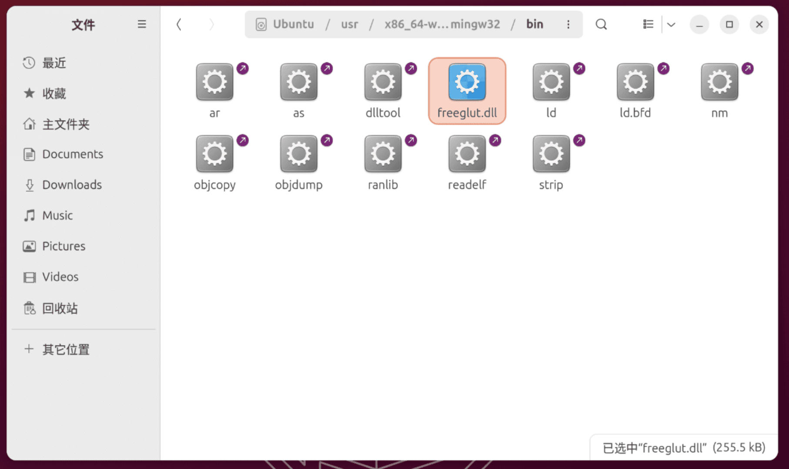
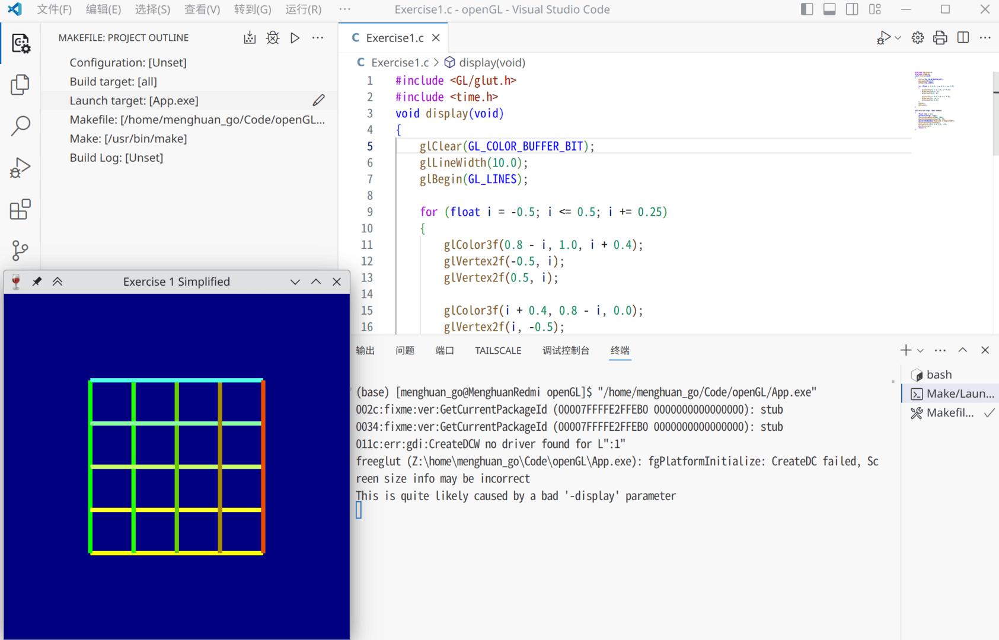
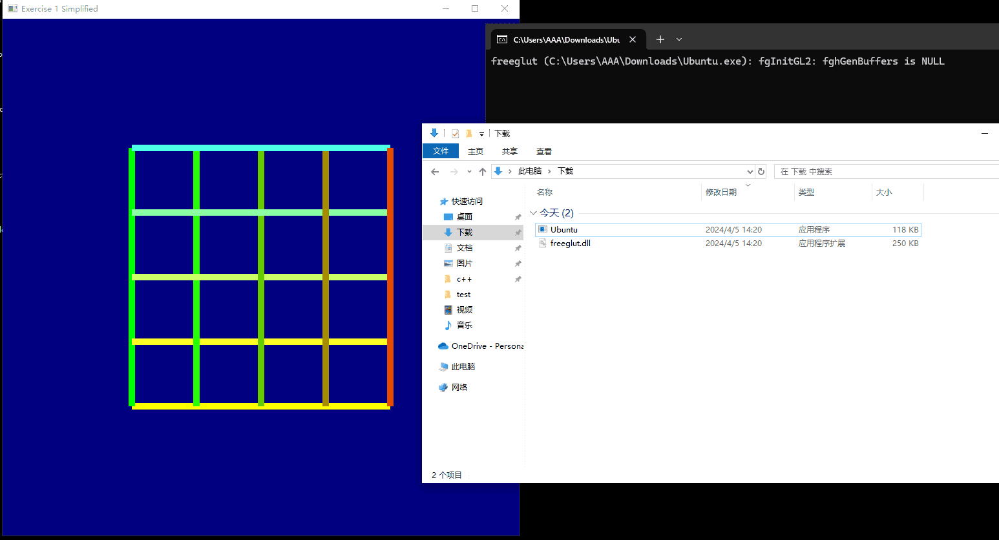

借助MinGW-w64，在Linux上也可以交叉编译出Windows可执行程序。前文提到在Windows上使用MSYS2配置openGL编译环境，虽然没出现什么问题，但是校园网不能支撑2k级别的远程桌面(1080P顶天了)，放在轻薄本的屏幕上看起来太不自在了。然而限于课程要求，需要编译出exe程序，于是便有了本文。

<!-- more -->

## 安装mingw-w64-gcc

使用包管理器安装：

::: code-tabs#install

@tab Arch Linux

```bash
sudo pacman -S mingw-w64-gcc
```

@tab Ubuntu

```bash
sudo apt install mingw-w64
```
:::

完成这一步之后就完了，就已经可以使用`x86_64-w64-mingw32-gcc`代替`gcc`进行交叉编译C程序，此时编译出来的已经是Windows程序了。不过考虑到我还需要使用GLUT，于是接着配置FreeGLUT。

## 配置mingw-w64-freeglut

### Arch Linxu

实际上AUR中已经有相应的包了。浏览一眼PKGBUILD并没有问题，于是进行安装：

```bash
paru -S mingw-w64-freeglut
# 如果你使用的AUR助手是yay
yay -S mingw-w64-freeglut
```
### Ubuntu

apt储存库中当然没有这个，因此理论上你得自己编译。不过你也可以和我一样从[transmissionzero](https://www.transmissionzero.co.uk/software/freeglut-devel/)下载二进制文件(~~节省时间~~)，选择`freeglut 3.0.0 MinGW Package`进行下载。

随后，将压缩包中的`bin`,`include`,`lib`文件夹中的内容复制到`/usr/x86_64-w64-mingw32/`的对应文件夹中。

> 由于包括上文的目标都是编译64位应用，因此对于对于`bin`,`lib`，复制其子文件夹`x64`的内容。



## 编译以及运行

那么整个流程就变成了：使用`mingw-w64-g++`进行交叉编译，再使用`wine`运行编译的结果。

配置Make文件如下

```Makefile
CC = x86_64-w64-mingw32-g++
SRC = Exercise1.cpp
OUT = App.exe

all:
	$(CC) $(SRC) -lfreeglut -lopengl32 -o $(OUT)

run: all
	wine $(OUT)

clean:
	rm -f $(OUT) $(OUT).exe
```

不出意外的话，如果你直接运行会得到以下报错：

```bash
0118:err:module:import_dll Library freeglut.dll (which is needed by L"Z:\\home\\menghuan_go\\Code\\openGL\\test.exe") not found
0118:err:module:loader_init Importing dlls for L"Z:\\home\\menghuan_go\\Code\\openGL\\test.exe" failed, status c0000135
```

因为仅仅是缺失了dll，将上文提到的从transmissionzero下载的压缩包打开，解压文件`freeglut/bin/x64/freeglut.dll`到Makefile所在文件夹就好了。



## 其他

当然，编译的成果也是能直接在Windows上运行的(前提是windows上有相应的freeglut.dll)。

