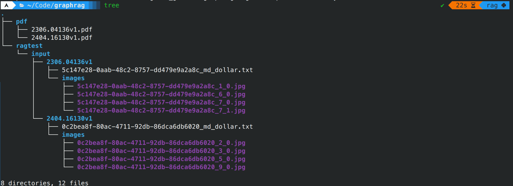
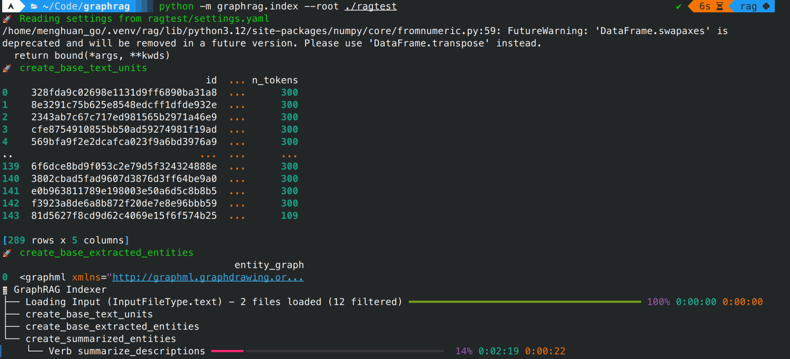

巨硬最近新出了个 [graphrag](https://github.com/microsoft/graphrag) ，号称其能提取有意义的结构化数据，不过遗憾的是默认情况下其只能读取txt或者csv数据。这次就让我们用~~我搓的~~外部库`pdfdeal`将PDF转换为带格式化的txt，再结合更便宜的deepseek进行构建。

<!-- more -->

## 安装并配置相应的库

为避免不必要的麻烦，请使用虚拟环境：
- [miniconda3](https://docs.anaconda.com/miniconda/),conda的最小化安装版本，当然你也可以直接使用Anaconda。
- [uv](https://github.com/astral-sh/uv)，一个非常快的包安装程序和解析器，使用Rust构建。
- 或者我写的调用uv以及conda达成多版本Python虚拟uv环境的脚本[uvv](https://github.com/Menghuan1918/uvv)。


::: code-tabs#python

@tab conda

```bash
conda create -n rag python=3.12
conda activate rag
pip install --upgrade pdfdeal graphrag
```

@tab uv

```bash
uv venv
source .venv/bin/activate # For Linux
source .venv/Scripts/activate # For Windows
uv pip install --upgrade graphrag pdfdeal
```

@tab uvv

```bash
uvv create -n rag -p 3.12
uvv activate rag
uvv install graphrag pdfdeal
```

:::


随后找一个你喜欢的文件夹，准备开始构建吧。

## Step1:转换PDF

由于巨硬这玩意儿只吃txt或者csv，首先我们需要将其转换txt才行。

一般而言有几种选择，效果从最差到最好：
- 直接提取纯文本部分转存(效果最差)
- 提取纯文本部分+图片进行OCR，也就是我写的[pdfdeal](https://github.com/Menghuan1918/pdfdeal)干的事情，不过这种方式遇到表格和公式就抓瞎
- 新型的（识别公式&格式的）OCR工具，一些代表：
    - 闭源(mathpix，Doc2X，simpletex)
    - 开源(nougat，marker)

此处选择了效果最好的[Doc2X](https://doc2x.noedgeai.com/)作为转换的工具(甚至每天免费500页，做慈善是吧)。首先得获得个人的API密匙，进入网站后通过点击身份信息，复制你的身份令牌作为api即可。

> 建议使用我的邀请码`4AREZ6`(手动滑稽)

随后新建两个文件夹，用于存储处理前的PDF以及处理后的txt文件：


```zsh
mkdir ./pdf
mkdir -p ./ragtest/input
```

随后把要处理的pdf丢到pdf文件夹中，此处我选择的是巨硬的graphrag[论文本身](https://arxiv.org/pdf/2404.16130)以及随机选了一个~~我感觉很重要~~的[参考文献](https://arxiv.org/pdf/2306.04136)。

使用`pdfdeal`的CLI工具`doc2x`进行批处理，其中记得加上长标示`--graphrag`以启用对graphrag的特殊适配：

```zsh
doc2x -k "Your Key Here" -o ./ragtest/input -p --graphrag ./pdf
```


等待其处理完成，就将所有的PDF文件转换为带格式(指md语法)的txt文档了：



## Step2:构建知识图谱(DeepSeek)

现在生成一下graphrag的配置文件，让我们对其进行修改一下使用DeepSeek：

```zsh
python -m graphrag.index --init --root ./ragtest
```

> [!tip]
> 如果你只打算使用默认的OpenAI的LLM以及嵌入模型，你仅需要修改.env中的Key就好了。
>
> 剧透提醒：graphrag的token消耗即为恐怖，不建议使用默认的gpt-4进行构建

找到`settings.yaml`文件，这就是我们需要修改的文件了。

我们需要修改两个部分，第一个部分为`llm`，记得修改`model_supports_json`为false：

```yaml
llm:
  api_key: Your DeepSeek Key
  type: openai_chat # or azure_openai_chat
  model: deepseek-chat
  model_supports_json: false # recommended if this is available for your model.
  max_tokens: 4000
  api_base: https://api.deepseek.com/v1
```

随后修改嵌入部分，此处我直接使用的是OpenAI的`text-embedding-3-small`。注意，由于llm中我们修改了`api_base`的值，嵌入中的`api_base`也需要相应修改，你可以改为任何兼容OpenAI格式的嵌入模型：

```yaml
embeddings:
  ## parallelization: override the global parallelization settings for embeddings
  async_mode: threaded # or asyncio
  llm:
    api_key: ${GRAPHRAG_API_KEY}
    type: openai_embedding # or azure_openai_embedding
    model: text-embedding-3-small
    api_base: https://api.openai.com/v1
```

随后输入命令，就是漫长的构建过程了(这两篇PDF花了十几分钟)，去喝杯茶吧：

```zsh
python -m graphrag.index --root ./ragtest
```



随后就可以对graphrag发起提问了：

::: code-tabs

@tab global

```bash
python -m graphrag.query \
--root ./ragtest \
--method global \
"Q"
```

@tab local

```bash
python -m graphrag.query \
--root ./ragtest \
--method local \
"Q"
```

:::

## 总结

由于效果部分实在是太长了，总结就放前面了

graphrag有效果吗？有，尤其是在有关联性的问题上效果非常明显，与Doc2X配合可以相当好的提取文档中的内容。

问题就出在：**这是一个token杀手，不管是构建还是在回答阶段**。

提示：这两个PDF文件的内容，如果直接放上下文中的话，加起来会消耗52525token。

以下是构建阶段消耗的token：

```csv
2024-07-14,deepseek-chat,graphrag,sk-b30da***********************283e,1334747,344702,1148
```

消耗了133万输入token，34万输出token。

虽然使用的Deepseek，仅花费了$0.28(¥2.02)，但是如果使用OpenAI的模型，即使是较为便宜的gpt-4o也需要$11.85(¥85.92)才能完成构建。

甚至于回答一个问题简单的问题，都会花费输入85293token，输出1848token。不过好在还有deepseek这个性能足够，并且非常便宜的异类来以支撑使用。

未来如果有更好的本地模型/或者更为强力且廉价的在线模型，或许就是graphrag重用之时吧。

## 效果
使用的问题为：

**讨论使用 LLM 生成图索引和回答用户查询的局限性。 在 Graph RAG 方法的未来迭代中如何解决这些限制？**

### graphrag(使用DeepSeek-Chat进行构建)，global模式

::: tabs#llms

@tab deepseek-chat

LLM在生成图索引和回答用户查询时面临的主要局限性包括处理复杂数据结构的能力、对大规模数据集的适应性以及在多跳问题回答中的准确性。这些局限性影响了LLM在实际应用中的效率和效果 [Data: Reports (124, 99, 141, 50, 70, +more)].

为了解决这些限制，Graph RAG方法的未来迭代可以通过引入更先进的图神经网络技术来增强LLM对图结构的理解和处理能力 [Data: Reports (117, 62, 111, 26, 123, +more)]. 此外，通过集成更多的领域特定知识和数据来训练LLM，可以提高其在特定领域查询的准确性和深度 [Data: Reports (117, 62, 111, 26, 123, +more)].

Graph RAG方法还可以通过优化算法和提高计算效率来减少处理时间，从而改善LLM在实时数据处理和动态查询的响应速度 [Data: Reports (117, 62, 111, 26, 123, +more)]. 同时，通过开发更高效的并行处理技术，可以提高处理大规模数据集的能力，从而在保持准确性的同时提高响应速度 [Data: Reports (124, 99, 50, 70, 141, +more)].

Graph RAG的开放源代码实现预计将显著影响数据处理和摘要领域，允许更广泛的协作和创新，从而进一步推动技术的发展 [Data: Reports (116)]. 通过改进的上下文处理技术，如优化上下文窗口大小和增强上下文理解能力，可以解决信息丢失问题 [Data: Reports (114)].

总之，通过这些改进措施，Graph RAG方法有望克服当前LLM在图索引生成和用户查询回答中的局限性，提高其在实际应用中的性能和效率。

@tab gpt-4o

### 使用 LLM 生成图索引和回答用户查询的局限性

在使用大型语言模型（LLM）生成图索引和回答用户查询时，存在多个局限性。首先，处理复杂和大规模数据集时的计算成本和内存限制是一个主要问题。LLM需要大量计算资源，生成和处理图索引可能会变得非常耗时和资源密集 [Data: Reports (136, 41, 149, 91, 96, +more)]。此外，LLM在处理复杂查询时的能力有限，特别是涉及多跳推理或复杂关系的查询，这可能导致回答的准确性和相关性下降 [Data: Reports (80, 111, 153)]。

另一个显著的局限性是信息丢失。长上下文可能导致信息丢失，从而影响模型的性能 [Data: Reports (114, 118)]。此外，LLM在知识更新和保持最新信息方面的能力有限。由于LLM的训练数据通常是静态的，无法实时更新，这可能导致生成的回答基于过时的信息 [Data: Reports (80, 111)]。最后，LLM在处理特定领域或专业知识时可能表现不佳，影响回答的准确性 [Data: Reports (80, 111)]。

### 解决这些限制的未来迭代方法

为了应对这些局限性，未来的Graph RAG方法可以通过多种方式进行改进。首先，可以通过集成增量学习模型（ILM）来解决知识更新的问题。ILM可以基于知识图谱进行持续学习和更新，从而保持模型对最新信息的敏感性和准确性 [Data: Reports (117)]。此外，优化上下文窗口的使用和减少所需的令牌数量也是一个有效的方法。这可以通过改进图索引技术和更高效的查询处理算法来实现 [Data: Reports (126, 52)]。

为了提高对复杂查询的处理能力，未来的Graph RAG迭代可以通过增强模型的多跳推理能力来实现。这可以通过改进知识图谱的结构和优化查询处理算法来实现 [Data: Reports (117)]。此外，结合更智能的分区策略和动态调整模块化方法，可以提高处理复杂查询的效率 [Data: Reports (52)]。

另一个潜在的改进是增强检索增强生成（RAG）技术。这涉及集成更复杂的检索机制，以提高生成答案的准确性和相关性，从而克服当前在全面性和多样性方面的限制 [Data: Reports (38)]。最后，开放源代码实现将允许更广泛的合作和创新，进一步推动技术进步，解决现有的局限性 [Data: Reports (116)]。

通过这些改进，未来的Graph RAG方法将能够更有效地处理大规模数据集，提供更准确和相关的答案，并保持对最新信息的敏感性。

:::


### graphrag(使用DeepSeek-Chat进行构建)，local模式
::: tabs#llms

@tab deepseek-chat

## 使用 LLM 生成图索引和回答用户查询的局限性

在使用大型语言模型（LLM）生成图索引和回答用户查询的过程中，存在一些显著的局限性。首先，LLM 在处理长文本时可能会遇到上下文窗口的限制，导致信息提取的召回率下降 [Data: Sources (32, 38)]. 此外，LLM 生成的图索引可能缺乏足够的细节和准确性，影响查询结果的全面性和多样性 [Data: Entities (15), Relationships (61, 62)].

## Graph RAG 方法的未来迭代中的解决方案

为了解决这些限制，Graph RAG 方法的未来迭代可以采取以下策略：

### 1. 改进图索引的生成
通过优化 LLM 的提示设计，提高图索引中实体和关系的提取精度。例如，使用更精细的提示来指导 LLM 识别和提取关键信息 [Data: Sources (38)].

### 2. 扩展上下文窗口
探索使用更大上下文窗口的 LLM 模型，以减少长文本处理时的信息丢失问题。这可以通过使用如 GPT-4-turbo 等具有更大上下文窗口的模型来实现 [Data: Sources (32)].

### 3. 增强社区摘要的生成
改进社区摘要的生成方法，使其更加全面和多样化。这可以通过结合多种社区检测算法和优化摘要生成策略来实现 [Data: Entities (15), Relationships (49, 50)].

### 4. 引入混合 RAG 方案
开发混合 RAG 方案，结合嵌入式匹配和 map-reduce 摘要机制，以提高查询响应的效率和质量 [Data: Entities (15), Relationships (45, 48)].

通过这些策略的实施，Graph RAG 方法可以更有效地解决当前的局限性，提升生成图索引和回答用户查询的性能。

@tab gpt-4o

# 使用 LLM 生成图索引和回答用户查询的局限性

## 局限性

### 1. 计算资源消耗
使用 LLM 生成图索引和回答用户查询的一个主要局限性是计算资源的高消耗。LLM 需要处理大量的文本数据，并生成复杂的图结构，这对计算资源提出了很高的要求。特别是当处理大规模数据集时，计算成本和时间成本都会显著增加 [Data: Sources (1, 2, 8)]。

### 2. 上下文窗口限制
LLM 的上下文窗口大小有限，这意味着在处理长文本或需要跨多个文档进行推理时，可能会丢失关键信息。尽管一些模型如 GPT-4-turbo 具有较大的上下文窗口，但仍然存在信息在长上下文中“丢失”的风险 [Data: Sources (9, 32)]。

### 3. 精度与召回率的平衡
在生成图索引时，需要在精度和召回率之间找到平衡。较长的文本块可以减少 LLM 调用的次数，但会导致召回率下降，因为 LLM 在处理长上下文时的性能会下降 [Data: Sources (9, 38)]。

### 4. 数据集多样性和适应性
当前的 LLM 和图索引方法在处理不同类型的数据集时表现不一。某些方法在特定类型的数据集上表现优异，但在其他类型的数据集上可能效果不佳。这种适应性问题限制了方法的通用性 [Data: Sources (43, 44)]。

## 未来迭代中的改进方向

### 1. 优化计算资源使用
未来的迭代可以通过优化算法和硬件加速来减少计算资源的消耗。例如，使用更高效的图分区算法和并行处理技术，可以显著提高处理速度和效率 [Data: Sources (14, 46)]。

### 2. 增强上下文窗口管理
为了应对上下文窗口的限制，可以开发更智能的上下文管理策略。例如，使用分层索引和分段处理的方法，将长文本分解为更小的、相关性更高的片段，从而提高信息的保留率和处理效果 [Data: Sources (1, 8, 32)]。

### 3. 提高精度与召回率
通过改进 LLM 的提示设计和优化图索引生成过程，可以在精度和召回率之间找到更好的平衡。例如，使用多轮提取和验证机制，确保在生成图索引时既能保持高精度，又能最大化召回率 [Data: Sources (9, 38)]。

### 4. 增强数据集适应性
未来的迭代可以通过引入更多的训练数据和多样化的测试集，来提高方法在不同数据集上的适应性。此外，开发自适应学习算法，使模型能够根据不同的数据集特性进行动态调整，也是一种有效的改进方向 [Data: Sources (43, 44)]。

## 结论

尽管使用 LLM 生成图索引和回答用户查询存在一些局限性，但通过优化计算资源使用、增强上下文窗口管理、提高精度与召回率以及增强数据集适应性，未来的迭代有望克服这些挑战，进一步提升方法的性能和通用性。Graph RAG 方法的持续改进将为大规模数据处理和复杂查询回答提供更强大的支持。

:::

### Dify

作为对比，我加入了Dify的结果。注意，此处的Dify是[按照这个流程](Something_new_4.md)配置的，使用带Rerank模型的完全体RAG流程。其中提示词等直接使用的默认模板，并未改动。

::: tabs#llms

@tab deepseek-chat

在使用大型语言模型（LLM）生成图索引和回答用户查询的过程中，存在一些局限性。首先，LLM可能无法完全理解复杂的图结构和节点之间的关系，这可能导致生成的索引不够精确。其次，LLM在处理大规模图数据时可能会遇到性能问题，因为它们通常需要大量的计算资源。此外，LLM可能无法很好地处理图中的动态变化，例如节点的添加或删除。

为了解决这些限制，未来的Graph RAG方法可以考虑以下几个方向：
1. **增强图结构理解**：通过引入专门的图神经网络（GNN）来增强LLM对图结构的理解能力，从而提高索引的准确性。
2. **优化计算效率**：开发更高效的算法和模型架构，以减少LLM在处理大规模图数据时的计算负担。
3. **动态图处理**：设计能够适应图动态变化的机制，例如增量学习或在线学习方法，以确保索引和查询结果的实时性和准确性。
4. **多模态融合**：结合文本信息和其他模态的数据（如图像、视频）来丰富图的表示，提高LLM对复杂查询的理解能力。

通过这些方法，未来的Graph RAG迭代有望克服当前的局限性，提供更强大、更高效的图索引和查询服务。

@tab gpt-4o

使用大型语言模型（LLM）生成图索引和回答用户查询存在一些局限性，主要包括以下几个方面：

1. **准确性和可靠性**：LLM 生成的内容可能包含错误或不准确的信息。这在处理复杂图索引时尤其明显，因为图索引需要精确的节点和边的描述。

2. **上下文理解**：LLM 在处理长文本或复杂上下文时，可能会丢失关键信息或误解上下文，这会影响生成图索引和回答用户查询的质量。

3. **计算资源**：生成和处理大规模图数据需要大量计算资源，LLM 的计算成本较高，可能不适合实时应用。

4. **可解释性**：LLM 的输出往往缺乏透明度和可解释性，这使得用户难以理解模型是如何得出结论的。对于图索引和查询回答，这可能导致用户对结果的信任度降低。

5. **动态更新**：图数据通常是动态变化的，而 LLM 生成的索引可能无法及时反映最新的变化，需要频繁更新模型。

在 Graph RAG（Graph Retrieval-Augmented Generation）方法的未来迭代中，可以考虑以下策略来解决这些限制：

1. **结合知识库**：将 LLM 与结构化知识库结合使用，通过知识库提供准确、可靠的信息源，减少 LLM 错误信息的风险。

2. **增强上下文处理能力**：改进 LLM 的架构，使其更好地处理长文本和复杂上下文。例如，使用层次化注意力机制或分段处理技术来保持上下文的一致性。

3. **优化计算效率**：开发更高效的算法和模型压缩技术，以减少计算资源消耗，提高实时应用的可行性。

4. **提高可解释性**：研究可解释 AI 技术，使 LLM 的决策过程更加透明。例如，通过生成解释性文本或可视化工具帮助用户理解模型输出。

5. **自动化更新机制**：设计自动化的数据更新机制，使图索引能够实时反映最新的信息变化。例如，使用增量学习或在线学习技术来动态更新模型。

通过这些改进措施，可以在未来迭代中提升 Graph RAG 方法在生成图索引和回答用户查询方面的性能和

:::
