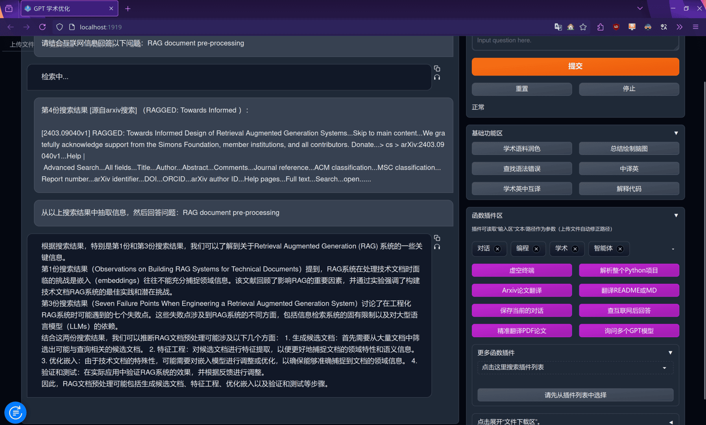
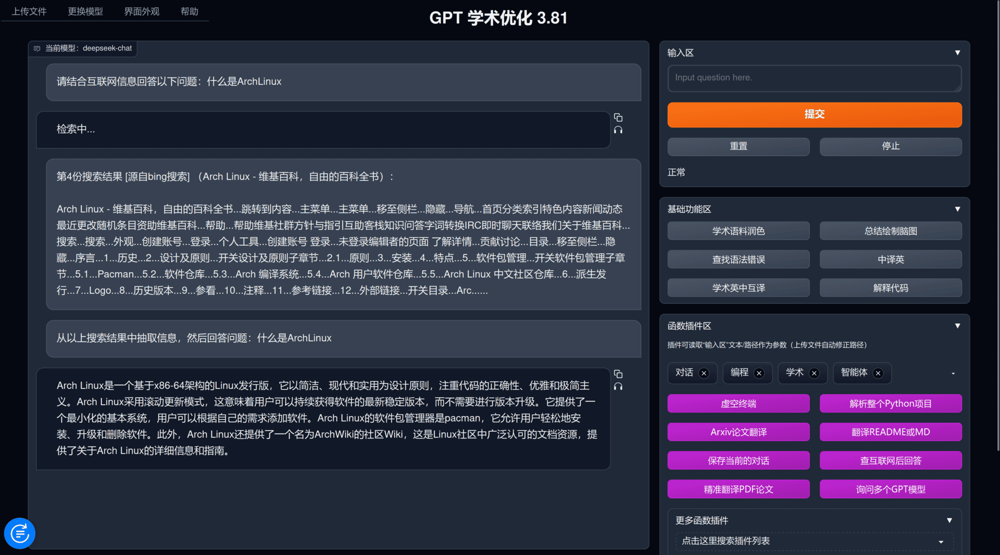
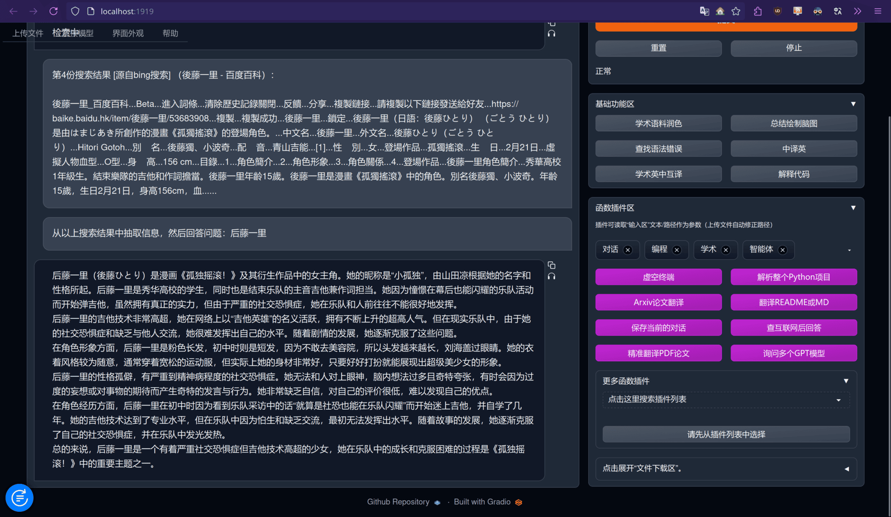
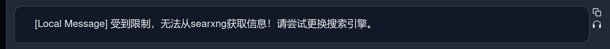

使用gpt_academic + searxng搜索，进行网页或者学术论文的快速检索。实验下来使用~~超级便宜的~~`deepseek-chat`也能有相当好的效果。不过由于要处理的文本量偏多，原版的`llama3`处理这种任务就有点力不从心了，可能需要使用上下文更大的本地模型才能有更好的效果。

<!-- more -->

## 效果展示

由于最近在研究RAG方面，先让它帮我搜下RAG方面文件处理的论文吧：



或者尝试下网页搜索：





## 部署searxng

首先假设你已经有你自己的服务器以及域名了，例如此处我将其部署在`searxng.mini-bocchi.top`上。当然你要是打算仅本地使用，只需要有电脑就行了(废话)。

随后遵从[searxng官方docker教程](https://github.com/searxng/searxng-docker)走：

```bash
cd /usr/local
git clone https://github.com/searxng/searxng-docker.git
cd searxng-docker
sed -i "s|ultrasecretkey|$(openssl rand -hex 32)|g" searxng/settings.yml
```

随后编辑下你的`.env`文件，其是给docker镜像中`Caddy`进行反代使用的。

> 如果你仅会在本地访问，不需要编辑`.env`文件中的`SEARXNG_HOSTNAME`，其默认就是`https://localhost`

随后`docker compose up -d`就好了，这时候你就可以访问之前设置的`SEARXNG_HOSTNAME`测试了。

> 或者是`docker-compose up -d`，取决于你的docker-compose版本

## 适配gpt_academic

此时虽然searxng已经配置好了，但是为了能在gpt_academic中使用API调用还需要一些额外的操作。

### 允许json形式的搜索并启用bing搜索

默认情况下searxng并不会启用bing搜索，以及搜索的入参形式也不支持json形式，编辑`/usr/local/searxng-docker/searxng/settings.yml`：
  
```yml
# see https://docs.searxng.org/admin/settings/settings.html#settings-use-default-settings
use_default_settings: true
server:
  # base_url is defined in the SEARXNG_BASE_URL environment variable, see .env and docker-compose.yml
  secret_key: "自动生成的密匙"  # change this!
  limiter: true  # can be disabled for a private instance
  image_proxy: true
ui:
  static_use_hash: true
redis:
  url: redis://redis:6379/0
engines:
  - name: bing
    disabled: false
search:
  formats:
    - html
    - json
```

> [!NOTE]
> 增加的部分是从`engines:`一行往下，其上面的部分请保留你的配置。

随后在gpt_academic的配置文件(即config_private.py)中添加一行`SEARXNG_URL = "你的URL"`即可。本地访问的话填写`https://localhost`即可。

## 其他

以下是一些额外的配置

### 将自己的IP加入白名单



searxng默认开启了按照IP的速率限制器，为了防止自己被限制了，最好将自己加到白名单中。编辑`/usr/local/searxng-docker/searxng/limiter.toml`：

```toml
# This configuration file updates the default configuration file
# See https://github.com/searxng/searxng/blob/master/searx/botdetection/limiter.toml

[botdetection.ip_limit]
# activate link_token method in the ip_limit method
link_token = true

[botdetection.ip_lists]

pass_ip = [
        '114.514.191.98/10',
]
```

> 可以配置很多个ip段

### 使用本机自带的Caddy

如果你部署的服务器和我一样，其宿主机上已经运行有一个Caddy反代服务了，那么在启动这个docker-compose时会提示你端口已经占用。你需要将`docker-compose.yaml`中所有和Caddy相关的部分删掉(或者注释掉)，随后编辑宿主机的`/etc/caddy/Caddyfile`：

```yaml
#...假设这是你以前的内容
searxng.mini-bocchi.top {
        encode zstd gzip
        reverse_proxy localhost:8080
}
```

### 假如你也在使用Cloudflare

如果你也开了CF的小黄云，需要自定义转发下发起方IP，否则searxng会一直将CF的服务器IP认为是请求方IP。

编辑`/etc/caddy/Caddyfile`：
```yaml
searxng.mini-bocchi.top {
        encode zstd gzip
        reverse_proxy localhost:8080 {
                header_up X-Forwarded-Port {http.request.port}
                header_up X-Forwarded-Proto {http.request.scheme}
                header_up X-Real-IP {http.request.header.CF-Connecting-IP}
                header_up X-Forwarded-For {http.request.header.CF-Connecting-IP}
        }
        tls /etc/ssl/mini-bocchi.pem /etc/ssl/mini-bocchi.key
        # 这是我的CF证书，换成你自己的
}
```